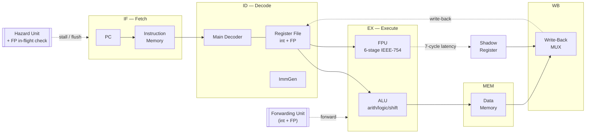
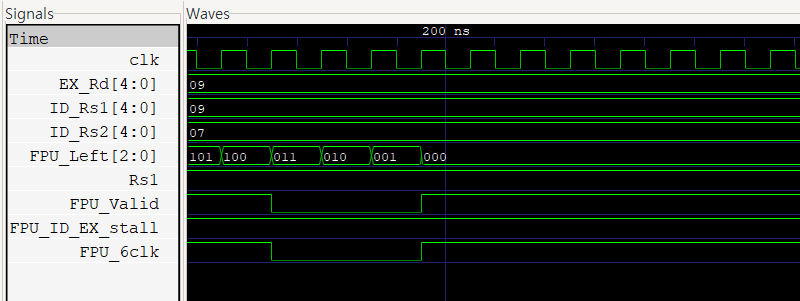
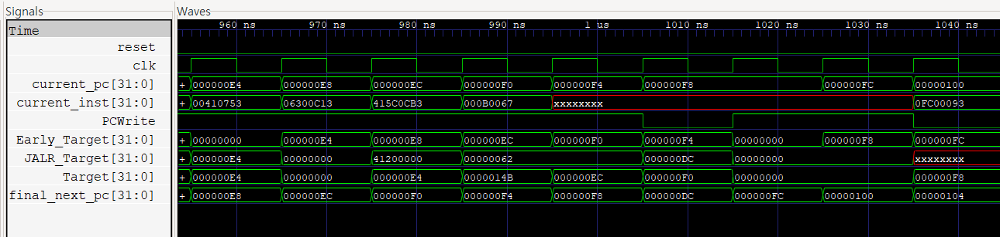
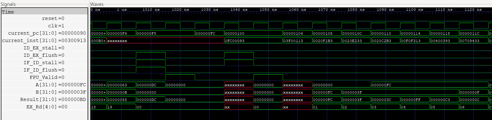

# Project 10: mini RISC-V CPU (RV32I + F Extension)

> *A RISC-V CPU that is both **designed** from the gate up and **verified** against an independent
> golden model — equal parts RTL design and design verification.*

A **32-bit RISC-V processor** — a 5-stage pipeline executing the RV32I integer subset together
with the **F extension** (single-precision floating point), driven by a fully pipelined
**IEEE-754 FPU** designed from scratch. Over 80 modules, integrated bottom-up and verified against
an independent Python golden model.

## System Architecture



The five classic stages run in order; the **FPU hangs off EX as a parallel multi-cycle unit**,
and its result rejoins the pipeline 7 cycles later through a shadow register. Forwarding and hazard
control wrap around the whole pipeline.

---

## 1. Introduction

Building on every earlier project (adder → subtractor → ALU → register system → control), this one
integrates them into a complete CPU. It is deliberately **two projects in one**:

- **RTL design** — an 80+ module, 5-stage pipeline with a from-scratch, pipelined IEEE-754 FPU,
  designed for correctness by construction (hazard handling, forwarding, FP integration); and
- **Design verification** — an *independent* golden model built from the ISA spec that checks every
  architectural result against the RTL, so correctness is *proven*, not assumed.

I care about both sides equally: designing the hardware, and building the environment that proves
it right. I brought the design up **one layer at a time**, verifying each before adding the next,
so a new bug always pointed to the layer that introduced it:

> **FPU (standalone)** → **integer core** → **hazard unit** → **forwarding** → **FPU integration**
> → **FP-aware forwarding & hazards** (operands still in flight inside the FPU)

---

## 2. Pipeline — stage by stage

| Stage | Role |
|-------|------|
| **IF** | PC selects the next instruction from Instruction Memory. The next-PC mux resolves `+4`, branch target, `jal`/`jalr` target, with **redirect priority over stalls**. |
| **ID** | `Main_Decoder` produces control signals and `is_*` flags; the register file (integer **and** FP) is read with a **write-first bypass**; `ImmGen` builds I/S/B/J immediates. |
| **EX** | ALU (arithmetic/logic/shift) and the FPU run here. Integer ops finish in one cycle; FP ops enter the 6-stage FPU. On a data hazard the **Forwarding Unit** pulls operands from MEM/WB; a needed but *in-flight* FP operand triggers a **stall**. |
| **MEM** | Data Memory load/store. FP stores (`fsw`) take their data from the forwarded FP operand. |
| **WB** | The write-back mux commits either the ALU/memory result **or** an FP result arriving late from the shadow register — into the correct (integer or FP) register file. |

---

## 3. RTL Design — the star modules

Rather than list all 80+ modules, here are the ones that define the difficulty of the project.

### 3.1 IEEE-754 FPU — 6-stage pipeline (`FPU.v`, `FADD_core.v`)
The FPU unpacks both operands into `{sign, exponent, fraction}`, runs a **pipelined adder and
multiplier in parallel**, and selects the result at the final stage:

```verilog
FADD_core #(.W(32)) u_FADD_core(.clk, .reset, .s1_en, .s1_op(s1_op[0]),
    .s1_SIGN_A, .s1_EXPO_A, .s1_FRAC_A, .s1_SIGN_B, .s1_EXPO_B, .s1_FRAC_B,
    .s6_ADD_out, .s6_OF(s6_OF_ADD), .s6_UF(s6_UF_ADD), .s6_rm);
FMUL_core #(.W(32)) u_FMUL_core(.clk, .reset, .s1_en, /* ... */,
    .s6_MUL_out, .s6_OF(s6_OF_MUL), .s6_UF(s6_UF_MUL));
// final stage: pick ADD or MUL, resolve overflow/underflow → Inf / 0
MUX #(.W(32)) s6_u_mux(.ADD_out(s6_ADD_out), .MUL_out(s6_MUL_out), .op(s6_op),
    .OF_ADD(s6_OF_ADD), .UF_ADD(s6_UF_ADD), .OF_MUL(s6_OF_MUL), .UF_MUL(s6_UF_MUL),
    .Final_out(s6_final_out), .OF(s6_OF), .UF(s6_UF), .ZF(s6_ZF), .sign(s6_sign));
```

Inside `FADD_core`, three datapaths (fraction / exponent / sign) advance together:

`unpack & compare (EXPO_SUB, comparator)` → `align + conditional-invert (barrel_shifter,
Cond_Inverter)` → `add A+B and B+A, restore magnitude (CLA, Magnitude_Restoration)` →
`normalize via leading-zero detect (Normalization_Controller, LZD)` → `shift + exponent adjust
(EXPO_CAL)` → `round + exception → Inf/0 (Rounding, Exception_Handler)`.

### 3.2 Forwarding Unit — integer and FP kept separate (`Forwarding_Unit.v`)
```verilog
CPU_Forwarding_Unit u_CPU(/* MEM/WB Rd vs EX Rs, integer RegWrite */);
FPU_Forwarding_Unit u_FPU(/* + FRegWrite, uses_FRs1/2 */);
Forwarding_Combine  u_Comb(.EX_is_FPU, .EX_is_FLW, .EX_is_FSW, /* select int vs FP */);
```

### 3.3 FP in-flight hazard detector (`FPU_Check.v`)
Because an FP result appears 7 cycles late, a consumer may depend on a value still inside the FPU.
A 7-stage shift register tracks in-flight destinations; the `EX_Rd` check catches the back-to-back
case the shift register alone would miss by one cycle:

```verilog
assign Rd0_next = (EX_is_FPU) ? {EX_Rd, 1'b1} : 6'b0;   // inject the producer now in EX
// shift Rd[0] → Rd[6] each cycle;  FPU_Valid = Rd[6][0]  (result is ready)
if (ID_is_FPU) begin
    if (EX_is_FPU && EX_Rd == ID_Rs1) FPU_Left = 3'd7;   // producer still in EX → full wait
    for (x = 0; x < 7; x = x+1)                           // producer already in flight
        if (Rd[x][0] && Rd[x][5:1] == ID_Rs1) FPU_Left = 6 - x;   // cycles left
end
```

### 3.4 Top module (`Pipeline_CPU.v`)
Wires the ~80 sub-modules into the five stages: PC / Instruction Memory, the ID decode + register
file, the EX ALU + FPU + shadow register, Data Memory, and the write-back mux — plus the
Forwarding and Hazard units that span the pipeline.

*(The remaining ~70 modules — adders, MUXes, barrel shifters, pipeline registers, etc. — are
modularized for reuse and left in the repository under `src_mini_CPU/`.)*

---

## 4. Verification — independent golden model

Hand-computing expected results is impossible here (FP math + branchy programs), so I wrote a
**Python ISS** that executes each program per the ISA spec and prints the final state as `check()`
lines. The DUT runs the same program; any disagreement is a DUT bug. The expected values come from
the **spec, not the DUT** — the core principle of DV.

| Test  | Focus |
|-------|-------|
| 01–03 | integer ALU, memory + forwarding, branches + backward loops |
| 04    | FPU integration, FP in-flight hazards, FSW→FLW round-trip, overflow→Inf |
| 05    | `jal` / `jalr` + mixed int/FP + subroutines |
| 06    | full ISA + nested `jalr` + control-flow × FP-stall (hardcore) |
| 07    | **MEGA — 120 instructions, every feature in one program** |

The 120-instruction MEGA test **passes on the first run**, matching the golden model bit-for-bit
across 30 integer and 30 FP registers.

---

## 5. Troubleshooting & Waveform Verification

The interesting bugs were never inside one feature — they lived where **two features collided in
time**, invisible to unit tests and only caught by the integration tests.

### FP in-flight hazard resolving correctly


`FPU_Left` counts `…101 → 100 → 011 → 010 → 001 → 000`: a consumer is held until its in-flight FP
operand is ready, then released and forwarded — exactly the hazard the FPU makes hard.

### Bug: a `jalr` return silently dropped by an FP stall


A nested `jalr` computed the correct target (`JALR_Target = final_next_pc = 0xDC`), but at that
cycle an FP result was draining and forced `PCWrite = 0` — so the PC never took the target. The
program ran off the end and **restarted from the top** (`PC` wraps to `0x100`, re-fetching the
first instruction):



This one root cause showed up as **seven unrelated-looking register corruptions**. **Fix:** a
control redirect forces `PCWrite = 1`, since it flushes the younger instructions anyway.

### Recurring lessons
* A **registered** signal arrives one cycle later than a combinational one — get the timing wrong
  and an FP result overwrites an integer write-back (the `FPU_6clk` bug).
* An **older** instruction (EX) must win over a **younger** one (ID) for any PC redirect (the
  branch-shadow-vs-`jal` bug).
* A **control redirect must beat a stall** — the PC has to take the target regardless (the bug above).

---

## 6. Module Hierarchy (80+ modules)

```
src_mini_CPU/
├── TOP_module/   Pipeline_CPU, Top_CPU, FPU
├── FADD/         FADD_core + EXPO_SUB, barrel_shifter, CLA, Magnitude_Restoration,
│                 Normalization_Controller, LZD, Rounding, Exception_Handler, SIGN, comparator …
├── FMUL/         FMUL_core + Multiplier, MUL_EXPO, Normalization_MUL, Exception_Handler …
├── ALU/          ALU, ALU_Control, calculate_group, logical_group, shift_group, ALU_MUX
├── Hazard/       CPU_Hazard, FPU_Hazard, FPU_Check, Hazard_Unit, Hazard_Combine
├── Forwarding/   CPU_Forwarding_Unit, FPU_Forwarding_Unit, Forwarding_Combine
├── PC/           PC_reg, PC_Adder, PC_Target, PCSrc
├── MUX/          PC_MUX, port_MUX, Result_MUX, CPU_MUX, FPU_MUX …
├── Register/     Register_file, Data_Memory, FPU_shadow_reg, Pipe_reg_1clk(_control/_en) …
└── (top level)   Main_Decoder, ImmGen, Instruction_Memory, Early_Jump_Unit, JALR_Jump_Unit
```

---

## 7. Conclusion

* **Full-system integration.** Assembled a complete RV32I + F processor from 80+ independently
  designed and verified modules, using a strict bottom-up, verify-as-you-go methodology.
* **From-scratch pipelined FPU.** Designed a single-precision floating-point unit with alignment,
  carry-lookahead addition, leading-zero normalization, rounding, and IEEE special cases
  (overflow → Inf, exact cancellation → 0), pipelined across six stages.
* **Independent golden-model verification (DV).** Built a Python ISS reference model *from the ISA
  spec* and verified the pipeline across seven integration tests, up to a 120-instruction program
  that passes bit-for-bit.
* **Real hardware debugging.** Located and fixed subtle *timing-collision* bugs (jump-vs-stall,
  branch-shadow-vs-jump, registered-signal delay) by reading waveforms and reasoning about pipeline
  timing — the class of bug only a hardcore integration test reveals.

### Next
A **SystemVerilog / UVM** verification environment for this same CPU — a class-based transactor, a
scoreboard driven by the golden model, and functional coverage — turning this golden-model flow
into a reusable, industry-style UVM testbench.

---

### Build & run
```bash
iverilog -g2012 -f F_file/<filelist>.f -s Pipeline_CPU -o cpu.out && vvp cpu.out
```
Golden model: `python/tools/riscv_iss.py` · Test programs & bug log: `memo/`
