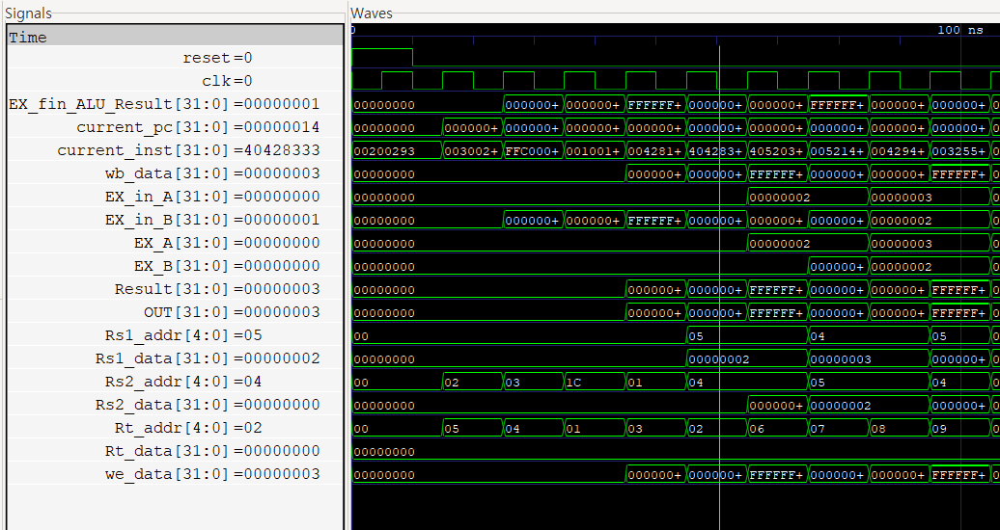
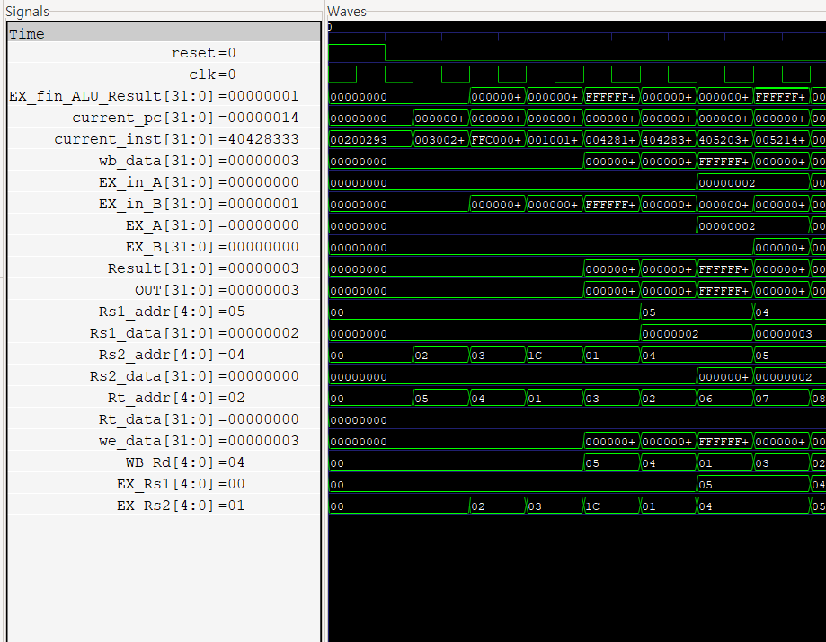
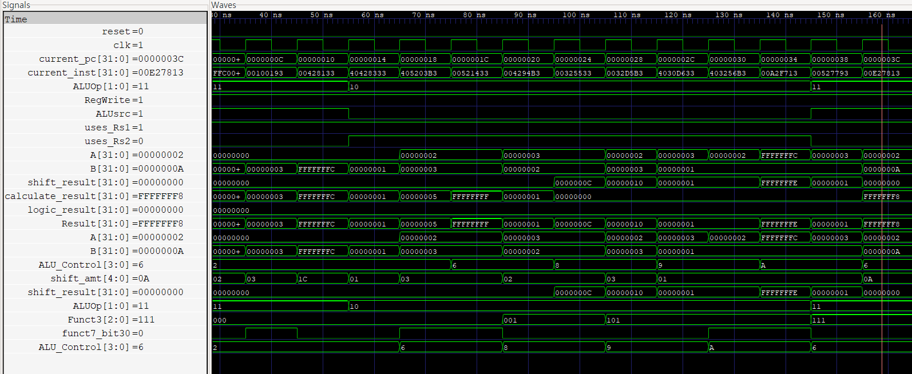

# Project10 mini CPU — Error Log

파형 오류 기록. 각 항목: 증상 / 원인(file:line) / 수정 / 확인(sol 파형).
이미지는 `img_m_CPU/` 폴더, 파일명 규칙: `CPU_ErrorN_설명.PNG`, 해결본은 `..._sol.PNG`.
※ [확인필요] 표시는 파형·파일명으로 증상은 분명하나, 원인/수정을 내가 단정 못 한 항목 — 한 줄만 보태주면 확정.

---

## [CPU 기본 / 명령어 메모리]

### E01 · program.txt 안 읽힘 (readmemh 실패)
- [파형] img_m_CPU/CPU_Error1.명령서파일이 안읽혀짐.PNG / 콘솔: `Instruction_Memory.v:9 $readmemh: Unable to open program.txt`
- [증상] instruction·address·result 전부 `xxxxxxxx`, CPU가 아무것도 실행 못 함
- [원인] `$readmemh` 경로 문제. F_file 폴더에 명령어 파일을 넣어 경로가 꼬임 (memo/ERROR 기록)
  - 추가 주의: readmemh 경로가 실행 디렉토리 기준 상대경로(`./verilog/...`)라, 프로젝트 루트에서 실행해야 함
- [수정] F_file에서 명령어 파일 삭제 → 정상 구동

---

## [Hazard / 분기(JAL·JALR·Branch)]

### E02 · 주소값 무한 반복 (Early Jump 항상 점프)
- [파형] img_m_CPU/CPU_Error2(해저드 유닛 전).JAL,나머지Branch추가하고 주소반복오류.PNG
  / 파형: Imm=6, Early_Target=0x12, is_JAL=1, PCSrc=1, pc=0xC
- [증상] 주소가 00 → (04 ↔ 08) 식으로 계속 반복, 명령어도 반복 실행
- [원인] Early_Jump_Unit: `assign PCSrc = (Early_Target) ? 1'b1 : 1'b0;`
  → Early_Target 값이 항상 참이라 매 사이클 PCSrc=1 → 매번 flush/점프
- [수정] if문으로 변경, **is_JAL일 때만** PCSrc 판정하도록

### E03 · BEQ 점프 위치 오류  ★git 확인 (commit 7a81d42)
- [파형] img_m_CPU/CPU_Error2(해저드 유닛전).BEQ 점프 위치 오류 CPU_vvp.PNG
- [증상] BEQ 성립 시 점프 목적지 주소가 틀림
- [원인] PC_MUX가 분기 타겟을 잘못 선택. 기존엔 단일 `PCSrc?Target:next_pc`라, ID단계 점프(JAL)와 EX단계 점프(분기)를 구분 못 함
  또한 PCSrc가 `ZF & is_BEQ`만 있어 다른 분기 미지원
- [수정] (commit 7a81d42) PC_MUX를 `ID_PCSrc→Early_Target`(ID점프), `EX_PCSrc→Target`(분기)로 분리 선택.
  PCSrc는 `(ZF&is_BEQ)|(!ZF&is_BNE)|(sign&is_BLT)|(!sign&is_BGE)`로 확장

### E04 · B-type Immediate ×2 오류  ★git 확인 (commit 7b3d9a1)
- [파형] img_m_CPU/CPU_Error3. B-type Immx2 오류.PNG
- [증상] B-type(및 J-type) 분기 offset이 어긋남(사실상 ×2/정렬 오류)
- [원인] ImmGen에서 B/J-type imm을 잘못 조립 — `inst[31]`을 중복으로 넣고, 맨 아래 LSB `1'b0`(바이트 오프셋의 내장 ×2)을 빠뜨림
  - 버그: `{{20{inst[31]}}, inst[31], inst[7], inst[30:25], inst[11:8]}`
- [수정] LSB에 `1'b0` 추가 + 중복 `inst[31]` 제거 (commit 7b3d9a1, ImmGen.v)
  - 정상: `{{20{inst[31]}}, inst[7], inst[30:25], inst[11:8], 1'b0}`  (J-type도 동일하게 `..., 1'b0`)

### E05 · JAL 명령어 미수행 / Early Jump IMM 오류  ★git 확인 (commit 7a81d42→7b3d9a1)
- [파형] img_m_CPU/CPU_Error3.JAL명령어 오류에 관해 Early Jump Unit IMM의 오류.PNG
  , img_m_CPU/CPU_Error3.JAL명령어가 수행되지않고 명령어는 0, 점프해야하는 명령어가 수행되는 오류.PNG
- [증상] JAL이 수행돼야 하는데 명령어가 0으로 flush되고, 엉뚱한(점프 대상) 명령어가 실행됨
- [원인] 두 버그가 겹침 —
  (1) Early_Jump_Unit `assign PCSrc=(Early_Target)?1:0` 이 항상 1 (commit 7a81d42에서 유입, E02와 동일)
  (2) ImmGen J-type imm이 `1'b0`(×2) 빠지고 inst[31] 중복 → JAL 타겟 주소 자체가 틀림 (E04와 동일)
- [수정] (commit 7b3d9a1) Early_Jump_Unit을 `if(is_JAL)`로 게이팅 + ImmGen J-type에 LSB `1'b0` 추가
- [확인] memo/ERROR: "Hazard 유닛은 잘 작동되어 flush되서 0이 되고 pc=12인 00C0006F 다음 명령어 수행됨"

### E06 · JALR + stall/flush 미작동  ◐부분확인 (commit 7b3d9a1 JALR구현 → 71c9c89 FPU타이밍)
- [파형] img_m_CPU/CPU_Error4(FPU포함) JALR과 stall연결후 flush와 stall이 제대로 작동안함.PNG
  / 파형: is_JALR=1, ID_PCSrc=1, JAL_add=0xC, wb_FPU_OF=x, wb_FPU_UF=x(빨강, 미정의)
- [증상] JALR을 stall과 연결한 뒤 flush/stall이 제대로 동작 안 함. wb_FPU_OF/UF가 x
- [git] commit 7b3d9a1에서 JALR 배선(`.is_JALR(ID_is_JALR)` 연결, 이전엔 `.is_JALR()` 빈칸).
  이후 CPU_Hazard에 `else if(EX_is_JALR)` flush 분기 존재(현재 코드). FPU 통합 타이밍은 71c9c89에서 정리
- [가설검증] 예전 AI가 준 3후보를 현재 코드로 대조 → 3개 다 이미 정상:
  ① stall 극성: Pipe_reg_1clk_control stall 1=hold, PC_reg PCWrite 1=전진 → 해저드 출력과 일치(반전 아님)
  ② x0 예외: CPU_Hazard.v:28 load-use에 `(EX_Rd != 5'b0)` 이미 있음
  ③ flush>stall 우선순위: Pipe_reg_1clk_control.v:10 `if(reset||flush)` 먼저 검사 → flush 우선(정상, commit 4f238ea부터 불변)
- [원인] 위 3개 아님. 결정적 단서 wb_FPU_OF/UF=x는 **FPU .clk/.reset 미연결(unclocked FPU의 x 전파)** 계열로 판단
- [수정] FPU .clk/.reset 연결(이미 수정됨). ※ 남은 의심 있으면 해당 파형 재확인으로 역추적

### E07 · BEQ 명령어 밀림  ✖오류아님 (관찰 착각)
- [파형] img_m_CPU/CPU_Error4(FPU포함) BEQ, 명령어 밀림오류.PNG
- [증상] BEQ 전후로 명령어가 한 칸씩 밀려 보임
- [결론] 실제 버그 아님. 모니터가 **IF단계 pc(IF_pc)와 ID단계 명령어(ID_inst)를 같이** 찍어서,
  서로 다른 스테이지라 자연히 한 칸 어긋나 보인 것 (정상 파이프라인 동작)
- [교훈] 파형/모니터에서 신호가 어느 스테이지 것인지 확인. 스테이지가 다르면 어긋나 보이는 게 정상

---

## [FPU 통합 — 포워딩]

### E08 · 포워딩 값 오류 (WB 포워딩이 ALU 결과만 전달)
- [파형] img_m_CPU/CPU_Error4(FPU포함) 사진에 모듈들에는 아무 문제 없음, 포워딩 문제.PNG
- [증상] 모듈 자체는 정상인데 포워딩된 값이 틀림 (특히 load/MemtoReg 결과)
- [원인] ALU_port_MUX의 `.WB_value(WB_ALU_Result)` → WB 단계 포워딩이 ALU 결과만 전달, load(MemtoReg) 결과는 전달 못 함
  (Pipeline_CPU.v, ALU_port_MUX 연결)
- [수정] `.WB_value(WB_OUT)` 로 변경 — CPU_MUX를 거친 최종 WB값(ALU/mem 선택 후)을 포워딩

---

## [port_MUX — operand-level 포워딩 MUX (self-TB 검증)]

ALU_port_MUX를 오퍼랜드 단위로 재작성한 새 MUX. 파형이 아니라 **직접 짠 테스트벤치**
(`tb/Testbench_port_MUX.v`, ref_model + 랜덤 500케이스)로 검증. 아래 두 버그 모두 self-TB가 잡음.
포워딩 코드 규칙: `00`=없음, `01`=둘 다, `10`=A(Rs1), `11`=B(Rs2). 우선순위 MEM > WB.

### E16 · 미포워딩 오퍼랜드 래치 + MEM/WB 배타 선택
- [증상] 랜덤 500케이스 중 ~3% FAIL. MEM=10/11(한 오퍼랜드만 포워딩) 케이스에서
  반대편 오퍼랜드가 이전 반복 값(래치)으로 뜸. 또 MEM=10 & WB=01처럼
  A는 MEM·B는 WB에서 와야 하는데 B가 안 옴 (예: got B=0x1d(잔여값), exp B=0x0e)
- [원인] always가 `if(MEM!=00) case(...) else if(WB) case(...)` 구조 —
  (1) case 2'b10/2'b11이 한쪽 오퍼랜드만 대입 → 나머지 미대입 = 조합 always 래치 추론
  (2) MEM·WB를 브랜치째 배타 선택 → MEM 브랜치에 들어가면 WB를 아예 안 봄
      → "A는 MEM, B는 WB" 조합이 불가능
- [수정] 오퍼랜드별 독립 구조로 재작성 (port_MUX.v)
  · always 맨 위 기본값 `EX_in_A=EX_A`, `EX_in_B=(ALUsrc)?imm:EX_B` → 래치 제거
  · A 체인 / B 체인 분리, 각 체인이 MEM(먼저)·WB를 모두 검사
    (A: 코드 01/10에서 포워딩, B: 코드 01/11에서 포워딩)
  · 기존 `WB`/`clear` wire(10~11행)는 불필요해져 제거 가능
- [확인] ref_model(A/B 독립 판정)과 대조해 해당 케이스 PASS

### E17 · B 블록 MEM 조건 오타 (10 vs 11)
- [증상] E16 재작성 후 오히려 FAIL이 3% → **9%로 상승**. MEM=10일 때 B에
  MEM_value가 잘못 들어감 (got B=MEM_value, exp B=WB값 또는 정상값)
- [원인] port_MUX.v:28 B 블록 MEM 조건이 `2'b01 || 2'b10`.
  A 블록(21행)을 복붙하면서 `10`을 `11`로 안 고침.
  `10`은 A(Rs1) 전용 코드 → B는 `01`(둘 다) / `11`(Rs2)이어야 함
- [수정] port_MUX.v:28 `2'b10` → `2'b11`
- [확인] self-TB 500케이스 **FAIL 0%**

### E18 · JALR일 때 rs1 포워딩 누락 (공유된 스펙 오해 → 테스트도 통과)
- [배경] TB 자극을 `case`(하나만 선택)에서 **독립 랜덤**으로 바꾸자 JALR+포워딩 조합이 나오기 시작
- [증상] JALR=1 & 포워딩 활성 케이스에서 A(rs1)에 포워딩값이 아니라 옛 `EX_A`가 들어감.
  근데 **테스트는 PASS** — DUT·ref_model 둘 다 "JALR이면 포워딩 무시"로 짜여 사이좋게 통과
  (예: JALR, WB=01, EX_A=23, WB_value=28 → A=23 나옴, 정답은 28)
- [원인] 설계 오해. JALR 타겟 = **rs1 + imm**이라 rs1을 읽음 → rs1이 앞 명령어 결과면 포워딩 필요.
  `jalr x0, x5, 0`처럼 방금 계산한 레지스터로 점프하는 흔한 패턴에서 옛값으로 잘못 점프.
  B는 imm이라 rs2 포워딩 무시는 맞음.
- [수정] DUT(port_MUX.v:16~19)·ref_model(Testbench:36~39) **양쪽 JALR 분기**에
  A 포워딩 추가(MEM>WB 우선), B=imm 유지
- [확인] 한쪽(DUT)만 먼저 고쳤을 때 483/484 케이스가 FAIL로 divergence를 드러냄
  (DUT 맞고 ref 뒤처짐) → 양쪽 맞춘 뒤 PASS
- [교훈] ① **공유된 스펙 오해는 테스트의 사각지대**. DUT·ref가 같은 오해를 하면 그냥 통과해버림.
  ref는 DUT가 아니라 **스펙(RISC-V)에서** 독립적으로 뽑아야 이런 걸 줄인다.
  ② **설계 결정을 바꾸면 DUT와 레퍼런스를 반드시 같이** 업데이트. 한쪽만 고치면 divergence FAIL.

### 검증 커버리지 (자극 개선 이력)
- 초기 TB: `case({$random}%3)`로 **조건 하나만** 켜서 조합(JALR+포워딩, ALUsrc+포워딩) 미검증
- `%1`(항상 0)·`%3`(코드 11 안 나옴) → `ALUsrc/JALR %2`, `MEM/WB %4`로 교체
- `case` → **각 조건 독립 랜덤**으로 교체 → 조합 커버 → **E18 발견**
- x0(Rd=0) 게이팅은 이 MUX 범위 밖(포워딩 유닛 소관)
- [교훈] 자기가 짠 설계라도 **독립 ref_model + 랜덤**이면 실제 버그를 잡는다.
  E16(구조)·E17(오타)는 파형 안 열고 self-TB가 검출. E18은 **조합 커버리지**를 넓혀야 드러났고,
  그마저도 "숫자를 직접 뜯어봐서" 스펙 오해를 잡은 것. → PASS 0%가 곧 정답은 아니다.

### 확장 — FP 오퍼랜드 + store 데이터 통합 (E19~E23)

정수 전용이던 port_MUX에 **FP 오퍼랜드(EX_F_A/B)** 와 **store 데이터 경로(EX_read_data_B)** 를 추가.
이 과정에서 새 버그 5종이 나왔고 전부 self-TB로 잡음.

- **E19 · `wire A/B` 폭 누락 (1비트)** — 소스 프리먹스 `wire A = (EX_is_FPU)?EX_F_A:EX_A;`에
  `[W-1:0]`이 빠져 **A/B가 최하위 1비트로 잘림** → EX_in_A/B가 0/1로 붕괴. **E09 재발.**
  → `wire [W-1:0] A/B`. (0% PASS가 이 수정을 역으로 증명 — 1비트면 clean ref와 갈려 FAIL 났을 것)
- **E20 · FSW 소스가 정수 rs2** — `B = (EX_is_FPU)?EX_F_B:EX_B`인데 **FSW는 `EX_is_FPU=0`**
  (store라 산술 아님) → FSW가 frs2 대신 정수 rs2를 저장. → `(EX_is_FPU || EX_is_FSW)?EX_F_B:EX_B`.
  ※ SW는 정수 rs2가 맞으니 소스 선택에서 **의도적으로 제외**(store 데이터 판정엔 포함).
- **E21 · store인데 EX_in_B가 포워딩으로 오염** — `if(fwd B) EX_in_B=MEM/WB_value`가 ALUsrc 무시하고
  덮어써서, **store(ALUsrc=1)의 ALU B(=imm 주소)가 rs2로 뒤바뀜** → 주소 깨짐.
  → 순서를 **"포워딩 먼저(fwd_B) → imm 먹스 나중"** 으로: `EX_in_B = (ALUsrc)?imm:fwd_B`, `store데이터 = fwd_B`.
- **E22 · EX_read_data 복붙 (MEM/WB)** — WB 포워딩 분기에서 `EX_read_data_B = MEM_value` (WB_value여야).
  E17과 같은 복붙 계열. → `WB_value`.
- **E23 · EX_read_data 래치** — store일 때만 대입 → 비store 경로 미대입 = 래치.
  → 삼항 `(FSW||SW)?fwd_B:{W{1'b1}}`로 전 경로 대입. all-1s는 **canary**(비store가 메모리로 새면 0xFFFFFFFF로 즉시 보임).

- [최종 구조] 오퍼랜드별 fwd_A/fwd_B(포워딩 먼저) → `EX_in_A=fwd_A`, `EX_in_B=(ALUsrc||JALR)?imm:fwd_B`,
  `EX_read_data_B=(SW||FSW)?fwd_B:{W{1'b1}}`. JALR은 A 포워딩·B=imm(E18).
- [검증완료] TB 자극을 **합법 인코딩(one-hot 명령어 타입 + 타입별 ALUsrc)** 으로 제약 후 500케이스 **FAIL 0%**.
  (독립 랜덤은 SW&FSW 동시=1, FPU&ALUsrc=1 같은 **불가능 조합**을 만들어 0%를 오염시켰음 → case로 제약)
- [남음] 유닛 레벨 검증. **CPU 통합(배선·타이밍)** 은 별개 관문. FSW의 frs2 포워딩이 FP 생산자(FRegWrite)에서
  오는지는 포워딩 유닛 소관 — 통합 시 확인.

---

## [FADD / FMUL 코어 — 비트폭·미선언]

### E09 · FPU 파이프 wire 폭 오류 (32비트 신호를 1비트로 선언)
- [파형] img(코드): `wire s1_IN_A, s1_IN_B;` → `wire [31:0]s1_IN_A, s1_IN_B;`
  / 콘솔: `first error.txt` — "Port 4 (Q)/Port 1 (IN) expects 32 bits, got 1. Padding 31 high bits"
- [증상] 컴파일 warning 다수, IN_A/B가 1비트로 잘려 FPU 결과 전부 깨짐
- [원인] s1_IN_A/B 등을 폭 지정 없이 선언 → 1비트 default
- [수정] `[31:0]` 폭 명시

### E10 · FRAC 파이프 레지스터 폭 오류 (W48 vs W23)
- [파형] img(코드): `Pipe_reg_1clk #(.W(48)) reg1_FRAC_A_s1_s2` → `#(.W(23))`
  / 콘솔: `first error.txt:11~22` — "Port 1 (D) expects 48 bits, got 23. Padding 25 high bits"
- [증상] FRAC s1→s2 레지스터가 48비트라 상위 25비트가 쓰레기로 패딩
- [원인] s1_s2 단계는 아직 23비트(순수 가수)인데 W(48)로 선언. s2_s3부터 hidden+guard 붙어 48비트가 맞음
- [수정] FRAC s1_s2 레지스터만 `.W(23)`으로, s2_s3 이후는 `.W(48)` 유지

### E11 · EXPO_big 파이프 신호 미선언 (elaboration error)
- [파형] 콘솔: `first error.txt:39~61` — "Net s3_EXPO_big is not defined ... Unable to bind s3~s8_EXPO_big"
- [증상] 23 error(s) during elaboration, 빌드 실패
- [원인] EXPO_big을 스테이지별로 파이프(s3~s8)하면서 해당 wire들을 선언 안 함
- [수정] `wire sN_EXPO_big;` 스테이지별 선언 추가

---

## [빌드 / 파일리스트]

### E12 · Unknown module type: Pipe_reg_1clk
- [파형] 콘솔: `iverilog -f FPU.f` → `FPU.v:113 error: Unknown module type: Pipe_reg_1clk` (다수)
- [증상] FPU가 쓰는 Pipe_reg_1clk 모듈을 못 찾아 빌드 실패
- [원인] FPU.f 파일리스트에 `Register/Pipe_reg_1clk.v` 경로 누락
- [수정] FPU.f에 Pipe_reg_1clk.v 경로 추가

---

## [Top module — 포트 미연결]

### E13 · op 값이 Z 상태 / SIGN 오류  ★확인 (commit a6911df Top_module_FADD_Error)
- [파형] img_m_CPU/Top_module_op값이_Z상태.PNG, img_m_CPU/Top_module_SIGN_error.PNG, Top_module_error.PNG
- [증상] FPU op가 `zzzz`(floating, high-Z)로 떠서 그 뒤 SIGN 등 결과가 전부 오류
- [원인] 상위 모듈에서 **op 포트를 연결 안 함** → op가 아무 드라이버 없이 floating(Z)
- [수정] op 포트를 제대로 연결. (관련: commit a6911df에서 FADD_core op 파이프 폭도 2비트→1비트 정리)
- [교훈] 신호가 `z`로 뜨면 = 드라이버 없음 = 포트 미연결/미선언 의심 (`x`는 충돌/미초기화, `z`는 floating)

### E14 · 뺄셈(op=01) 오류 — 결과가 두 개 / result_out=x, error=x  ★근본원인 확인
- [파형] img_m_CPU/FPU_ERROR3_ 뺄셈결과가 두개가 나오는 상황.PNG
  · 추가파형: "FSUB_결과두개_op01"(EX_FPU_Control=01, EX_FPU_Result 40966666→40066667 두 값)
  · 추가파형: "FSUB_result_x_op01"(op=01, IN_A=4185A640, IN_B=BC7C1070, result_out=3Fxxxxxx, error=x)
  · 근본원인파형: "FADD_core_eff_sub_floating"(Cin·Q·D·eff_sub 빨강=미정의)
- [증상] 뺄셈(op=01)에서 결과가 두 개로 갈리거나 result_out/error에 x가 섞임
- [원인] FADD_core.v:153 `Normalization_Controller` 인스턴스에 **eff_sub 미연결(floating)**.
  eff_sub 파이프가 s3까지만 있고(s3_eff_sub), stage4 정규화기에는 안 넘어감.
  → Normalization_Controller.v:24 `if(eff_sub)`가 x로 동작 → 뺄셈 정규화 방향이 불확정 → 결과 갈림/x
  (컴파일 경고로도 확인: "Normalization_Controller ... dangling input port 3 (eff_sub) floating")
- [수정] eff_sub를 s3→s4로 한 단 더 파이프(`Pipe_reg_1clk_en #(.W(1)) ... .Q(s4_eff_sub)`)하고
  FADD_core.v:153에 `.eff_sub(s4_eff_sub)` 연결 → 뺄셈 정규화 정상화
  ※ 덧셈(op=00)/곱셈(op=10)은 eff_sub=0이라 영향 없어 정상 보였던 것
- [참고] FMUL은 정상 동작 확인 (파형 "FMUL_1.5x2.0_정상": 3FC00000×40000000=40400000 = 1.5×2.0=3.0 ✓)
- [검증완료] eff_sub 연결 후 시뮬 통과:
  · 5.5-2.25=3.25 → 40500000 ✓ (예전엔 두 값으로 갈렸음, 이제 단일 안정값)
  · 3.0-2.0=1.0 ✓, 4.0-1.0=3.0 ✓, 3.4-1.3 → 40066667(실제 피연산자 기준 올바른 반올림)
  · dangling eff_sub 컴파일 경고 사라짐

### E15 · 완전상쇄(A−A) 뺄셈이 0을 못 만듦  ★신규 발견 (eff_sub 검증 중)
- [증상] 결과가 정확히 0이 되는 뺄셈에서 0이 아닌 값 출력 + ZF=0
  · 1.0-1.0 → 3f800000(1.0), 2.5-2.5 → 40000000(2.0), 2.0-2.0 → 40000000, π-π → 40000000 (모두 ZF=0)
  · 완전상쇄가 아닌 뺄셈은 전부 정상 (3.0-2.0, 4.0-1.0, 5.5-2.25 ✓)
- [원인] Normalization_Controller.v:24-29 — eff_sub & all_zero(가수 전부 0)일 때 `doing=0`만 하고
  **지수를 0으로 안 만듦** → 결과=(원래지수, 0가수)=2.0 등. all_zero가 지수단으로 전파 안 됨.
  MUX.v:13 `ZF=(Final_out[30:0]==0)`도 지수가 남아 0 판정 실패
- [수정] `EXPO_break` 신호 신설: Normalization_Controller에서 `eff_sub & all_zero`이면 1,
  s4→s5→s6 파이프 후 EXPO_MUX.v:11 `EXPO_out=(EXPO_break)?0:EXPO_temt`로 지수를 0으로 강제
- [검증완료] 시뮬 통과: 1.0-1.0 / 2.5-2.5 / 2.0-2.0 / π-π → 전부 00000000, ZF=1.
  일반 뺄셈(3.0-2.0, 4.0-1.0, 5.5-2.25)·덧셈 회귀 없음

---

## [통합 검증 — CPU에 프로그램 올려 돌리기]

port_MUX랑 FPU까지 다 붙이고, 드디어 실제 프로그램(정수 16개 + 끝에 `jal x0,0` 루프)을 처음으로 CPU에 올려봤다.
레지스터 파일을 TB에서 직접 못 들여다봐서(iverilog가 계층 배열 참조를 막는다. 계층 wire도 안 됐다) —
결국 `WB_Rd/WB_RegWrite/WB_OUT`를 Pipeline_CPU 출력 포트로 빼서, WB 커밋을 TB 안 그림자 레지스터에 복사해
최종 상태를 비교하는 식으로 검증했다. 손으로 계산한 기대값이랑 대조.

첫 판에 x2, x14, x15, x16이 FAIL 났다.

### E24 · `add x2`가 옛날 x4를 읽음 — 레지스터 파일이 write-first가 아니었다

- [파형] `img_m_CPU/CPU_E24_add_x2_옛x4.PNG` (기본), `img_m_CPU/CPU_E24_EX_Rs타이밍.PNG` (EX_Rs1/Rs2/WB_Rd 추가본)
  
  
  · `add x2`(current_inst=00428133)가 EX로 내려온 시점을 봤다. `EX_in_A=2`(x5)는 맞는데 **`EX_in_B`가 0**으로 떴다.
    `Rs2_data`·`EX_B`도 0 — x4=3이 아직 레지스터 파일에 안 들어온 상태였다.
  · 두 번째 캡처에 `EX_Rs1/EX_Rs2/WB_Rd`를 얹어서 다시 봤다. `EX_Rs2=04`로 **x4를 제대로 겨냥**하는 건 맞았다.
    근데 바로 그 사이클에 `we_data`로 x4=3이 **써지는 중**이라, 조합 읽기가 그 값을 못 잡았다.
    "같은 사이클 write/read"가 눈으로 잡힌 순간이었다.

- [증상] x2 = `add x2, x5, x4`. 기대 5인데 **2**가 나왔다. x5(2)는 맞는데 x4가 0으로 들어간 값.

- [처음엔 포워딩인 줄 알았다] 파형 보니 add x2가 x4를 **WB에 써지기 전에** 읽어간 것 같았다.
  그래서 당연히 포워딩 문제겠거니 하고 Forwarding_Unit부터 뜯었다. EX_Rs1/EX_Rs2가 옛날 값으로 보여서
  "WBtoEX가 발동됐어야 하는데 안 됐네, 타이밍 버그다" 싶었다. 여기서 시간을 좀 썼다.

- [근데 거리를 세보니 아니었다] `add x2`(I5)랑 `addi x4`(I2)는 **3칸** 떨어져 있었다.
  I5가 EX에 있을 때 I2는 **이미 WB를 지나 은퇴**한 상태 — WB 스테이지에 없다.
  당겨올 게 없으니 **WBtoEX가 발동될 수가 없다.** 포워딩이 잡는 건 거리 1,2뿐이고,
  **거리-3은 원래 레지스터 파일이 write-first로 처리하는 몫**이었다. 내가 포워딩 범위를 착각한 거였다.

- [원인] Register_file이 `posedge 동기 쓰기 + 조합 읽기` 구조라, I2가 WB에서 x4를 쓰는 바로 그 사이클에
  I5가 ID에서 x4를 읽으면 **쓰기가 아직 안 보여서 옛 값(0)** 을 가져간다. 같은 사이클 write/read가 해결 안 됨.

- [결정적 단서] x6(`sub x5,x4`)은 PASS였다. x6은 x4랑 **거리-4**라 쓰기가 이미 보인다.
  **딱 거리-3인 x2만 깨진 것** — 이걸 보고 "아 포워딩이 아니라 regfile이구나" 확신했다.
  x6은 되는데 x2만 안 되는 걸 나란히 놓고 본 게 원인 특정의 열쇠였다.

- [수정] Register_file 읽기 포트에 write-first bypass 추가:
  ```verilog
  Rs1_data = (Rs1_addr==0) ? 0 : (we && we_addr==Rs1_addr) ? we_data : mem[Rs1_addr];
  Rs2_data = (Rs2_addr==0) ? 0 : (we && we_addr==Rs2_addr) ? we_data : mem[Rs2_addr];
  ```
  쓰는 값(we_data)을 읽기 포트로 바로 우회. 같은 사이클에 write되는 레지스터를 읽으면 mem 대신 we_data를 준다.

- [확인] x2 = 5, PASS. 거리-3 의존성 해결.

- [배운 것] 포워딩(거리 1,2)과 레지스터 파일 write-first(거리 3)는 **역할이 나뉘어 있다.**
  "읽기 전에 값을 못 받았다"고 전부 포워딩 문제가 아니다. 생산자가 소비자 EX 시점에 **어디 있는지**
  (MEM이냐 WB냐 이미 은퇴했냐)를 먼저 따져야 한다. 다음부터 이런 건 거리부터 세보자.

### E25 · andi 3개가 뺄셈이 됨 — ALU_Control이 ANDI를 SUB 코드로 내보냈다

- [파형] `img_m_CPU/CPU_E25_andi_ALU_Control6.PNG`
  
  · andi 구간에서 ALU의 세 그룹 출력을 다 띄워봤다. `logic_result`가 0으로 죽어있고,
    `calculate_result`(FFFFFFF8 = 2−10)를 `Result`가 골라가고 있었다. "andi인데 왜 뺄셈이 나오지?"
  · `ALU_Control`을 파형에 올려보니 andi(ALUOp=11, Funct3=111)일 때 값이 **6**이었다.
    6 = `0110` = SUB 코드. 여기서 딱 걸렸다.

- [증상] x14/15/16(전부 andi)이 AND가 아니라 뺄셈을 하고 있었다.
  · x14 = 2−10 = −8, x15 = 3−5 = −2, x16 = 3−14 = −11 (기대는 2, 1, 2)

- [처음 짐작] `logic_result`가 0이길래 logical_group이 고장난 줄 알았다. 근데 `Result`가 calculate를
  고른 걸 보고 "문제는 선택이고, 그 위 ALU_Control이 원인이겠다" 싶어 한 칸 위로 거슬러 올라갔다.

- [원인] `ALU_Control.v:55` — ANDI(ALUOp=11, Funct3=111) 케이스가 `4'b0110`(SUB 코드)로 박혀 있었다.
  AND 코드는 `4'b0000`인데(같은 파일 45번 R-type AND가 0000인 걸 보면 확인됨) 실수로 SUB를 넣어둠.
  그래서 ALU_MUX가 `4'b0110`을 보고 `calculate_result`(뺄셈)를 골랐다.

- [수정] `ALU_Control.v:55` `4'b0110` → `4'b0000` (ANDI → AND)

- [확인] andi일 때 ALU_Control이 6 → 0으로 바뀌고 ALU_MUX가 `logic_result` 선택.
  x14=2, x15=1, x16=2 전부 PASS. **정수 16개 전부 PASS.**

- [남은 것] `ALUOp=11`(I-즉시값) 케이스가 ADDI/ANDI만 있다. 나중에 ORI/XORI/SLTI/slli/srli/srai
  즉시값 쓰면 케이스가 없어 default로 빠져 깨진다. 지금 프로그램엔 없어서 급하진 않지만 나중에 채울 것.

- [배운 것] 증상은 "MUX가 엉뚱한 그룹을 골랐다"였지만 원인은 한 칸 위 ALU_Control의 코드였다.
  그룹 출력(logic/calculate/shift)이 이상하면 그룹 자체를 뜯기 전에 **ALU_Control 값부터 파형에 띄워보는** 게 빨랐다.

---

**정수 통합 1차 마무리**: 첫 판 FAIL 4개(x2, x14, x15, x16)를 두 버그로 정리 —
E24(레지스터 파일 write-first, 거리-3 해저드)와 E25(ALU_Control ANDI→SUB 오타). 둘 다 잡고 **16/16 PASS**.
프로그램·기대값 표는 [[통합테스트_01_정수]] 참고.

---

## [미해결 — 현재 진행중]

### OPEN-1 · FPU_Valid 타이밍 정합 — 해결 (2026-08-01)
- [증상] 다중 사이클 FPU에서 result 준비 시점과 FPU_Valid strobe 정합
- [측정] FPU latency = 입력 후 **7 clk**에 안정 (6 clk엔 과도기 쓰레기값)
- [원인] FPU_Check `FPU_Valid <= Rd[6][0]`(등록)이라 **지연 8** → result/shadow(지연 7)보다 1clk 늦음
- [수정] `assign FPU_Valid = Rd[6][0]`(조합, **지연 7**)로 shadow layer6·코어(7)에 정렬. **해결.**

### OPEN-3 · FPU 통합 첫 시도 — 결과가 전부 틀림 (명령어 흐름은 정상, FP 데이터패스 의심) (조사중)
- [파형] `img_m_CPU/CPU_OPEN3_FADD_FSUB_2clk.PNG` (FADD/FSUB 2클럭 첫 발견),
  `img_m_CPU/CPU_OPEN3_FPU_IF_ID_stall.PNG` (FPU_IF_ID_stall·PCWrite 추가본 — 스톨 확인)
  · FPU를 CPU에 붙여 처음 돌렸는데 **결과가 전체적으로 다 틀림.**
- [명령어 흐름·스톨 = 정상] FADD/FSUB가 ID에 2클럭 머무는 건 **load-use 스톨**(fadd가 바로 앞 `flw` 결과를
  써야 함) — 맞는 동작. 스톨 뒤에 다음 명령어가 제대로 들어오는 것도 파형으로 확인. **명령어 유실 없음.**
  (처음엔 "FSUB이 사라진다"고 봤는데 다시 보니 정상 진행이었음. 스톨→다음명령어 순서 OK)
- [그럼 범위 좁혀짐] 파이프라인 제어(스톨/flush/PC)는 정상이니, **결과가 틀린 건 FP 데이터패스**
  = FP 오퍼랜드 라우팅 / FP 포워딩 / 결과선택 MUX / shadow_reg / FPU_Valid 정렬 / FP writeback 중 하나.
- [할 일] CPU의 **FP 레지스터 파일 값**을 ISS 골든값(f1=1.5, f3=3.5 …)과 대조.
  · 검증용: `WB_FRegWrite`+`WB_OUT` 로 **FP shadow 레지스터**를 하나 더 만들어 비교 (정수 때처럼)
  · 파형: `wb_data`가 `wb_fregwrite=1`일 때 어떤 값을 어느 레지스터에 쓰는지 → ISS랑 비교
  · 의심 1순위: FPU_Valid 정렬(방금 고침), shadow_reg가 제어신호를 결과와 같이 나르나, 결과선택 MUX
  (참고: FPU_Check FSW for문 버그도 아직 열려 있음 → 아래 OPEN-4에서 터짐)

### OPEN-4 · FSW에서 파이프라인 멈춤 + MemWrite=0 (FPU_Check FSW for문 버그로 추정) (조사중)
- [파형] `img_m_CPU/CPU_OPEN4_FSW_ID_is_FSW_z.PNG`
  FSW(`00A02827` = fsw f10, 16(x0)) 차례에 `FPU_IF_ID_stall=1`·`PCWrite=0`으로 **스톨이 걸린 채
  안 풀림** → 뒤 명령어가 아예 안 들어옴. `MemWrite=0`이라 저장도 안 됨. `ID_is_FSW=z`(배선 누락)도 여기서 보임.
- [해석] MemWrite=0은 **원인이 아니라 증상**. FSW가 스톨에 갇혀 ID에서 못 나감 → MEM 도달 못 함
  → MemWrite 안 뜸(저장 X) + PC 멈춰서 파이프라인 정지. 한 방향으로 다 설명됨.
- [원인 ① 확정 — 배선 누락] 파형에서 **`ID_is_FSW = z`(floating)** 발견. Pipeline_CPU의 Hazard_Unit
  인스턴스에 **`.ID_is_FSW(ID_is_FSW)` 연결이 빠져** 있어 입력이 드라이버 없이 떠 있었다.
  → FPU_Check의 `else if(ID_is_FSW)`가 z로 동작 → FSW 해저드 검출 불확정 → 쓰레기 스톨.
  (z는 드라이버 없음. 우리가 계속 쓰던 "z=floating=포트 미연결" 그것)
  → [수정] Hazard_Unit 인스턴스에 `.ID_is_FSW(ID_is_FSW)` 추가.
- [원인 ② 아직 남음 — for문] 위를 고쳐서 ID_is_FSW=1이 들어오면, 이번엔 FPU_Check FSW 분기(~58행)에
  **for문이 없어** 잔값 `x`(=7)로 `Rd[7]` 범위밖([0:6]) 접근 → FPU_Left 쓰레기. **둘 다 고쳐야 함.**
  → [수정] FSW 분기를 FPU 분기처럼 `for(x=0;x<7;x=x+1)`로 감싸기 (Rs2만 검사).
- [확인 필요] 둘 다 고친 뒤: FSW가 f10 준비되면 스톨 풀림 → MEM 도달 → MemWrite=1 → mem[16] 저장.
  MemWrite=0은 원인이 아니라 증상(FSW가 MEM 못 감)이었음.
- [교훈] `z`가 보이면 논리 뜯기 전에 **배선부터** 확인. 파형에 신호 하나 z로 뜬 게 결정적 단서였다.

### OPEN-5 · ImmGen이 FLW/FSW immediate를 안 만듦 — opcode 케이스 누락 (원인 확정)
- [파형] `img_m_CPU/CPU_OPEN5_ImmGen_FLW_imm0.PNG`
  · FLW 구간(`Opcode=07`, `inst=00002087`)에서 **`imm_out = 00000000`**. offset이 있어야 하는데 0으로 나옴.
  · FLW/FSW인데 ImmGen이 immediate를 0으로 뱉음 → 주소 = `rs1 + 0` → **offset이 통째로 무시됨.**
- [증상] `flw f2, 4(x0)` 같은 게 mem[4]가 아니라 mem[0]을 읽음 (offset 4가 사라짐).
  FP 로드 주소가 다 어긋나 → 로드값 쓰레기 → FADD/FSUB/FMUL 결과 전부 틀림 ("절망적"의 큰 원인 중 하나).
- [확증] 실제 CPU 돌려보니 **f1(offset 0)만 PASS, 나머지 전부 FAIL.** offset 0인 f1은 mem[0]을 맞게
  읽는데, f2(offset 4)·f7(offset 8)… 은 offset이 0으로 뭉개져 전부 mem[0]을 읽어서 틀림.
  **"첫 로드(offset 0)만 통과, 나머지 다 실패"가 정확히 ImmGen offset 버그의 signature.**
- [원인] ImmGen의 opcode별 `case`문에 **FLW(`0x07`)·FSW(`0x27`)가 없어** default(0)로 빠짐.
  둘 다 I/S-type이라 immediate 위치는 lw/sw와 똑같은데, 케이스에 안 넣어둠.
- [수정] ImmGen case에 추가 (lw/sw와 같은 위치):
  · FLW(`0x07`, I-type): `imm = {{20{inst[31]}}, inst[31:20]}`  (lw 케이스에 opcode만 추가하면 됨)
  · FSW(`0x27`, S-type): `imm = {{20{inst[31]}}, inst[31:25], inst[11:7]}`  (sw와 동일)
- [교훈] **새 명령어(FLW/FSW)를 추가할 땐 손댈 곳이 여러 군데** — 디코더, ALU_Control/FPU_Control,
  **ImmGen**, 그리고 배선(OPEN-4의 ID_is_FSW)까지. ImmGen을 빠뜨려서 offset이 0으로 샜다.
  (inst_Generator에도 flw/fsw 추가해야 하는 것과 같은 맥락 — "명령어 하나 = 여러 모듈 손봄")

### OPEN-6 · FP in-flight 해저드 정합 (fadd/fsub/fmul·FSW ← in-flight FP 결과) — 해결 (2026-08-05, all-pass)
in-flight FP 결과를 바로 쓰는 케이스(`fadd f9 → fsub f10`, `fsub f10 → fsw f10` 등)에서 **버그 4개가 겹쳐** 있었음.
공통 뿌리: in-flight FP 명령어 하나에 **검출·카운트·주입·스톨** 4곳을 다 안 맞춘 것.

- **[버그1 · 검출 지각]** `img_m_CPU/CPU_OPEN6_5_FPU_Left000_EXRd_miss.PNG`
    `FPU_Check`의 `if(ID_is_FPU)` for문이 시프트레지스터 `Rd[]`만 훑고 **지금 EX의 프로듀서(`EX_Rd`)를 안 봄**.
    `fadd f9`(EX)→`fsub f10`(ID) back-to-back에서 f9는 아직 Rd[] 주입 전(posedge 대기)이라, `ID_Rs1=EX_Rd=09`인데 **`FPU_Left=000`**(111이어야).
    → 수정: for문 밖에 `if(EX_is_FPU && EX_Rd==ID_Rs1/2) FPU_Left=3'd7;` (EX 프로듀서를 조합으로 검출).

- **[버그2 · 재주입 데드락]** `img_m_CPU/CPU_OPEN6_6_Rd0next0_inject_kill.PNG`
    FP 스톨이 `ID_EX_stall=1`(freeze)이라 프로듀서가 EX에 갇힘 → 주입(`Rd0_next=EX_Rd`)이 매 클럭 **재주입** → 시프트레지스터가 안 빠져 `FPU_6clk=1` **영구 스톨**.
    (반대로 주입을 스톨로 게이팅하면 f9가 아예 증발해 x9까지 깨짐 — 둘 다 freeze가 원인.)
    → 수정: `FPU_Hazard.v:28,35` FP 스톨을 `ID_EX_stall` → **`ID_EX_flush`**(버블). 프로듀서가 EX 빠져나가 배수됨.
      주입은 `FPU_Check.v:14` `Rd0_next = EX_is_FPU ? {EX_Rd,1'b1} : 0` (스톨 무관 — 버블 클럭엔 EX_is_FPU=0이라 중복 자동방지).
      ※ 힌트: 바로 밑 FLW 분기(`FPU_Hazard.v:47`)가 이미 flush를 쓰고 있었음.

- **[버그3 · countdown 안 내려감]** `img_m_CPU/CPU_OPEN6_7_FPU_Left_le_bug.PNG` → 해결 `CPU_OPEN6_8_sol_countdown.PNG`
    Rs1 for문 부등호가 `<=`(거꾸로). `FPU_Left`는 매 클럭 0에서 시작(조합, `:37`)이라 `6<=0`이 항상 거짓 → **111 한 클럭 뒤 000 추락**.
    → 수정: `FPU_Check.v:48` `<=` → **`>`**, 카운트 `6-x`로 통일. FPU_Left가 7,6,5…0 매끄럽게 하강.

- **[버그4 · FSW store 실패 = cascade FAIL의 뿌리]** `img_m_CPU/CPU_OPEN6_9_FSW_missing_EXRd.PNG`
    `fsw f10`이 in-flight f10을 저장해야 하는데, **FSW 분기(`ID_is_FSW`)에도 버그1과 같은 EX_Rd 검출 누락**.
    → FSW가 f10 준비 전 EX 진입 → `EX_is_FSW`·`imm`이 한 클럭 반짝하고 flush에 지워짐 → store 못 함
    → `mem[16]=0` → `flw f12=0` → `f13,f15,f16,f18` 전부 잘못된 f12로 **cascade FAIL**(FP 계산 자체는 정확했음, f17만 f12 무관이라 PASS).
    → 수정: FSW 분기(`FPU_Check.v:63~`)에도 `if(EX_is_FPU && EX_Rd==ID_Rs2) FPU_Left=3'd7;` + `6-x` (FPU 분기와 동일).

- **[결과]** 정수+FP 통합 **x1~x18 all-pass** → `통합테스트_04_FPU.md`
- **[교훈]** in-flight FP 명령어 하나엔 **검출(EX_Rd 조합비교)·카운트(6-x)·주입(스톨무관)·스톨(flush)** 4곳을 같이 맞춰야.
    그리고 **FPU 분기(`ID_is_FPU`)와 FSW 분기(`ID_is_FSW`)는 별개** — 같은 수정을 둘 다 해야 함(버그4).
    반복 실수: 등록/posedge 신호는 한 클럭 지각(OPEN-1 계열), 부등호 방향(max는 `>`), 스톨은 소비자(ID)만 잡고 프로듀서는 흘려보내기.

---

## [경미]

### MINOR-1 · 시간축이 sec로 표시
- [증상] FADD/FPU 파형에서 시간이 ns가 아니라 `sec`로 보임
- [원인] 일부 모듈에 `` `timescale `` 없음 (컴파일 경고: "Some modules have no timescale")
- [수정] TB/모듈에 `` `timescale 1ns/1ps `` 통일

### MINOR-2 · FPU_Hazard.v:16 `FPU_6clk` 암시적 wire
- [수정] `wire FPU_6clk;` 명시 선언 추가 권장
