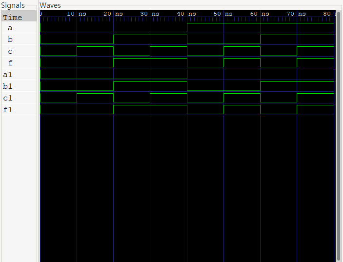

# My Verilog Design Project
 >>Goal: Build a soild foundation in Professional hardware design

 ## Table of Contents
1. [Project 1:Combinational logic gate](#project-1-combinational-logic-gate)
2. [Project 2:Binary Adder](#project-2-binary-adder)

## Project Structure
- **src/**: RTL Design source codes.
- **tb/**: Testbench files for functional verification
- **scripts/**: Compilation scripts and FileList (.f)

## Why use a Terminal?
- CLI-based execution
- Tools such as iverilog and vvp are CLI-based therefore, they must be executed through the terminal.
- It allows me to identify errors and monitor simulation logs in real-time through text output.

## Simulation
 Established the simulation environment using Icarus Verilog and FileList(.f).

```bash
# How to execute
iverilog -f ./scripts/calculate_add.f -o calc.out
vvp calc.out
```

Executing iverilog generates a compiled output file(.out), which is required to run the simulation.
->This indicates that the source code is free of syntax errors.

## Waveform Analysis
 Visual Verification 

```bash
# How to execute
gtkwave calc.vcd
```
Running vvp successfully generates a .vcd file containing the simulation results.


----------------------------------------------------------------------


### Project 1: Combinational logic gate
>Goal: Optimize and minimize complex logic circuits

f=(~x)&y&z|(~x)&y&z|x&z

Excessive complexity increases hardware resource usage -> High gate count(High resources usage)

->>Applied Boolean Algebra for logic minimization.

-  Design:   
1) Gate-level Modeling(combinational_logic.v)
    
    -Focuses on the physical connection between logic gates (NOT, AND, OR).
    
    -Explicitly defines internal wires and gate instances.

    ```bash
    module combinational_logic(x,y,z,f);
        input x,y,z;
        output f;

        wire w_inv_x, w_inv_z;
        wire w_and3_0, w_and3_1, w_and2_0;

        not inv_x(w_inv_x,x);
        not inv_z(w_inv_z,z);

        and and3_0(w_and3_0,w_inv_x,y,z);
        and and3_1(w_and3_1,w_inv_x,y,w_inv_z);
        and and2_0(w_and2_0,x,z);

        or or3_0(f,w_and3_0,w_and3_1,w_and2_0);
    endmodule
    ```
    -I manually defined internal wires and specified every input/output connection for each logic primitive (NOT, AND, OR).
 
    -The syntax follows the standard gate instantiation format: gate_type instance_name(output, input1, input2, ...)

    -The code is error-prone, verbose, and highly inefficient.

2) Data-flow Modeling(standard_logic.v)
    
    -Focuses on the logical behavior and signal flow.
    
    -Uses assign statements for a more concise and readable standard design.

    ```bash
    module standard_logic(
        input x,y,z,
        output f
        );

        assign f=(~x)&y|x&z;
    endmodule
    ```

    The code size was significantly reduced through Boolean simplification. 
    
    I was able to simplify the expressions using Boolean algebra.

    **f=(~x)&y&z|(~x)&y&(~z)|x&z(Original) -> f=(~x)&y|x&z**

-  Testbench: 
1) combinational_logic_tb.v  ->compare two design source code

    -Objective: To validate that both designs produce identical outputs for all possible input combinations (Truth Table).

    -Mechanism: A 3-bit counter (integer i) applies all 8 possible states ($2^3$) to both uut0 and uut1 simultaneously

    ```bash
    `timescale 1ns/1ps
    module combinational_logic_tb;
        reg a,b,c;
        reg a1,b1,c1;
        wire f;
        wire f1;

        initial begin
            $dumpfile("com_b.vcd");
            $dumpvars(0,combinational_logic_tb);
        end

        combinational_logic uut0(
            .x(a),
            .y(b),
            .z(c),
            .f(f)
        );

        standard_logic uut1(
            .x(a1),
            .y(b1),
            .z(c1),
            .f(f1)
        );

        integer i;
        initial begin
            for(i=0;i<8;i=i+1)begin
                {a,b,c}=i;
                {a1,b1,c1}=i;
                #10;
            end
            $finish;
        end
    endmodule
    ```
    
### waveform Analysis



-Validation: By comparing f and f1 in the GTKWave waveform, I confirmed that the optimized logic (Data-flow) performs exactly the same function as the complex gate-level circuit.


### Conclusion & Key Takeaways

Through this project, I gained a deeper understanding of:
* **Logic Optimization:** How physical gate interconnections can be translated into Boolean equations and minimized to save hardware resources.
* **Abstraction Levels:** The practical difference between Gate-level and Data-flow modeling in Verilog.
* **Verification Workflow:** Using testbenches and GTKWave to ensure functional equivalence after refactoring logic.

**In summary, I learned how a compiler or synthesizer interprets high-level logic into physical hardware gates and the importance of efficient logic design.**