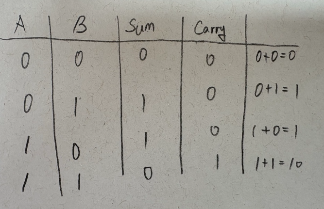
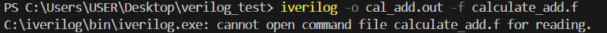
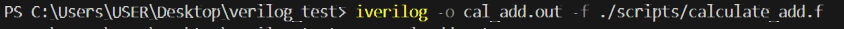
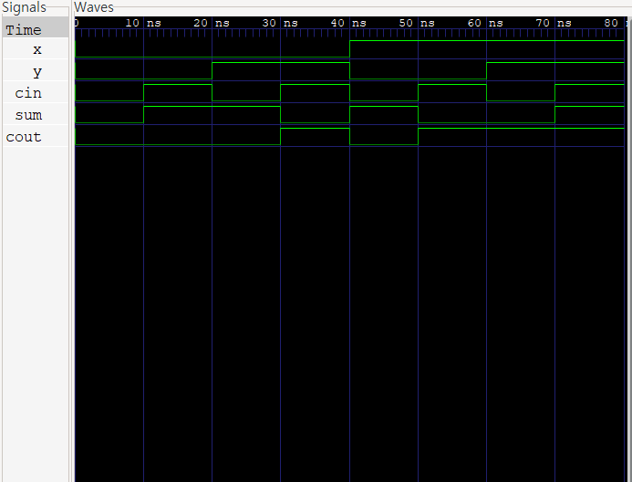

### Project 2: Binary Adder

>Goal: Understand the architecture of a Half Adder and extend it to design a Full Adder capable of processing carry-in signals from lower-order bits.


1.Background: Binary Addition and Carry HandlingThe core challenge in both decimal and binary arithmetic is the precise handling of the Carry. To implement functional binary addition, we transition from a basic Half Adder to a Full Adder.

**Half Adder**: Limited to adding two bits; it lacks a Carry-in cin input.

**Full Adder**: Designed to process two input bits plus a cin from the preceding bit, making it the building block for multi-bit adders.

2.​Logic Derivation & Hardware Modeling

    Derived the hardware logic gates by analyzing the binary addition truth table.
    


    - Sum: Corresponds to the XOR operation, which outputs '1' only when inputs $a$ and $b$ are different.

    - Carry: Corresponds to the AND operation, where a carry-out occurs only when both inputs $a$ and $b$ are '1'

    - Bit-0 Matching: The LSB (Least Significant Bit) of the binary sum of $a$ and $b$ is identical to the Sum output.

- Design Code

1) Module 1: Half Adder

```verilog
    module half_adder(
        input a,b,
        output sum, carry
    );

        assign sum=a^b;
        assign carry=a&b;

    endmodule
```
    
    Inputs: a, b 
    Outputs: sum, carry

​
**Module 2**: Full Adder
    
```verilog
    module calculate_adder(
        input x,y,cin,
        output sum,cout
    );

        wire s1,c1,c2;

        half_adder HA1(
            .a(x),
            .b(y),
            .sum(s1),
            .carry(c1)
        );

        half_adder HA2(
            .a(s1),
            .b(cin),
            .sum(sum),
            .carry(c2)
        );

        assign cout=c1|c2;
    endmodule
```

- Port Configuration: Defined $x, y, cin$ as inputs and $sum, cout$ as outputs.

- Internal Signal Declaration: Declared wires $s1, c1$, and $c2$ to connect internal signals between components.

- Module Instantiation: Instantiated two Half Adders (HA1, HA2) to construct the Full Adder logic.

- Port Mapping Logic: Used named port mapping (e.g., .a(x)).
    - .a: Represents the port name defined in the half_adder module.
    - (x): Represents the signal in the current calculate_test module being connected to that port.

​
Component Connections:

- The Sum from the first Half Adder ($HA1$) is connected to signal $s1$, and its Carry is connected to $c1$.
- The second Half Adder ($HA2$) takes $s1$ and $cin$ as inputs ($a, b$) to produce the final Sum and the internal carry $c2$.

Final Output Generation:
​
- Signals $c1$ and $c2$ are processed through an OR gate to output the final carry-out ($cout$).

- This logic signifies that a carry is generated if either of the intermediate carry signals is '1'.
​

Logical Justification for the OR Gate:

- Using an OR gate at the final stage is logically sound because $c1$ and $c2$ are structurally mutually exclusive.

- Case $c1=1$: Occurs when both $a$ and $b$ are '1', which forces $s1$ to be '0'.
- Case $c2=1$: Occurs only when $s1$ and $cin$ are both '1'

Conclusion: Since $s1$ cannot be '0' and '1' simultaneously, $c1$ and $c2$ never conflict. Thus, an OR gate is appropriate for the final logical combination.
​

3.Testbench Implementation & Verification

```verilog

`timescale 1ns/1ps
module calculate_add_tb;
    reg x,y,cin;
    wire sum,cout;

    calculate_adder uut(
        .x(x),
        .y(y),
        .cin(cin),
        .sum(sum),
        .cout(cout)
    );

    initial begin
        $monitor("a=%b, b=%b, cin=%b | sum=%b, cout=%b",x,y,cin,sum,cout);
    end

    initial begin
        $dumpfile("calculate.vcd");
        $dumpvars(0,calculate_add_tb);
    end

    integer i;

    initial begin
        for(i=0;i<8;i=i+1)begin
            {x,y,cin}=i;
            #10;
        end
        $finish;
    end
endmodule
```
Signal Declaration:
- Declared reg types for inputs (x, y, cin) to drive values within the initial block.
- Declared wire types for outputs (sum, cout) to observe the results from the DUT (Design Under Test).

Unit Under Test (UUT) Instantiation:
- Instantiated the Full Adder module as uut and mapped the internal signals to the testbench variables.

Monitoring & Simulation Control:
- Utilized the $monitor task to track signal changes in real-time within the console.
- Configured $dumpfile and $dumpvars to generate VCD (Value Change Dump) files for waveform analysis.

Automated Test Stimulus:
- Implemented a for loop with an integer variable i to generate all possible 3-bit combinations (&2^3 = 8&).
- Assigned each bit of i to $x, y$, and $cin$ respectively to verify the full truth table of the design.
​

### Waveform Analysis

Utilized scripts to link design modules and testbenches stored in separate files for an efficient iverilog workflow.

### Troubleshooting
​
The following path-related errors occurred during the verification process.

This error occurred because the target files were not located in the current terminal's working directory.


​
Resolved the issue using the following method


​

Through Waveform Verification,the logical correctness of the design was confirmed using the following example:

Verification Example: For $x=1000, y=0101$, the expected sum is $1101$.
1) Bit 0 (LSB): $x=0, y=1, cin=0 \rightarrow sum=1, cout=0$ (observed at 20ns~30ns)
2) Bit 1: $x=0, y=0, cin=0 \rightarrow sum=0, cout=0$ (observed at 0ns~10ns)
3) Bit 2: $x=0, y=1, cin=0 \rightarrow sum=1, cout=0$ (observed at 20ns~30ns)
4) Bit 3 (MSB): $x=1, y=0, cin=0 \rightarrow sum=1, cout=0$ (observed at 40ns~50ns)

Conclusion: The total sum is $1101_2$, confirming the logical integrity of the design through waveform analysis.

​

​

4.Conclusion & Key TakeawaysThrough this project, I realized that verification is just as critical as writing the code itself.

- Rigorous Design Habits: While handling the Full Adder’s Carry-out (Cout), I logically proved that c1 and c2 are mutually exclusive and cannot occur simultaneously. This exercise helped me develop a rigorous design habit to proactively prevent potential hardware conflicts.

- Debugging & Analysis Skills: By performing bit-level analysis on GTKWave waveforms, I verified that the design intent was accurately reflected in the actual hardware timing. This process significantly strengthened my debugging capabilities and my understanding of hardware behavior.