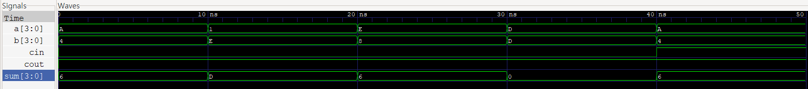

# Project 3: Subtractor

## 1. Introduction & Design Architecture

### Introduction
Following the design of the Adder, this project explores the operational principles and structure of a Subtractor in digital logic circuits. The primary objective is to understand how subtraction is executed at the hardware level, thereby establishing a solid foundation for designing more complex Arithmetic Logic Units (ALU).

### Design Direction
To perform subtraction efficiently within a digital system, this project employs the **2's Complement** arithmetic method instead of implementing a dedicated, separate subtractor circuit. This approach aims for a practical and industry-standard architectural design that optimizes hardware resources by reusing the existing Adder structure.

* **Absolute Difference Implementation**: The data path is specifically designed to control the inputs so that the minuend is always greater than or equal to the subtrahend. This ensures that the final output result is always a positive integer (absolute value).


## 2. RTL Design

### 1) Design Module 1: Half Adder (`half_adder`)
```verilog
module half_adder(
    input a, b,
    output sum, carry
);
    assign sum = a ^ b;
    assign carry = a & b;
endmodule
```

* **Description:** Designed a basic Half Adder circuit that takes two inputs (a, b) and outputs the sum and carry using XOR and AND logic.

### 2) Design Module 2: Full Adder(`adder`)
```verilog
module adder(
    input a, b, cin,
    output sum, cout
);
    wire s1, c1, c2;
    
    half_adder FA0(
        .a(a), .b(b),
        .sum(s1), .carry(c1)
    );

    half_adder FA1(
        .a(s1), .b(cin),
        .sum(sum), .carry(c2)
    );

    assign cout = c1 | c2;
endmodule
```
* **Description:** Designed a Full Adder module by instantiating two Half Adders.

* **Internal Routing:** Declared internal wires to connect the modules. $s1$ passes the sum of a and b to the second Half Adder, while c1 stores its carry. c2 stores the carry generated from adding cin and s1. Finally, the overall carry-out (cout) is obtained by applying an OR operation between c1 and c2.

### 3) Design Module 3: N-bit Absolute Subtractor (calculate_sub)
```verilog
module calculate_sub #(parameter N=4)(
    input [N-1:0] a, b,
    output [N-1:0] sum,
    input cin,
    output cout
);
    wire [N-1:0] val_a = (a >= b) ? a : b;
    wire [N-1:0] pre_b = (a >= b) ? b : a;
    wire [N-1:0] val_b = ~pre_b;
    wire [N:0] ci;
    
    assign ci[0] = 1'b1;
    
    genvar i;
    generate
        for(i=0; i<N; i=i+1) begin: gen_cal
            adder FA(
                .a(val_a[i]),
                .b(val_b[i]),
                .cin(ci[i]),
                .sum(sum[i]),
                .cout(ci[i+1])
            );
        end
    endgenerate

    assign cout = ci[N];
endmodule
```
* **Scalability:** Unlike the previous 1-bit modules, this subtractor processes multi-bit data. A parameter (N) is declared to ensure bit-width scalability without affecting the core logic.

* **Conditional Assignment (Absolute Difference):** To guarantee that the result is always a positive integer, the data path is dynamically controlled so that the minuend is always greater than or equal to the subtrahend. The pre_b wire temporarily stores the smaller value before converting it into its 2's complement form.

* **2's Complement Hardware Implementation:** To realize 2's complement subtraction in hardware efficiently, the smaller input is logically inverted (1's complement via ~pre_b), and the initial carry-in (ci[0]) of the adder chain is hardwired to 1. This ensures logical simplicity and allows the reuse of the existing adder architecture.

* **Generate Block:** Since the number of operations depends on the parameterized bit-width, a generate loop is utilized to instantiate N Full Adders automatically. The MSB of the carry wire array (ci[N]) is then assigned to the final cout.

## 3. Testbench & Verification

```verilog
`timescale 1ns/1ps
module calculate_sub_tb;
    reg [3:0] a, b;
    reg cin;
    wire [3:0] sum;
    wire cout;

    calculate_sub #(.N(4)) uut(
        .a(a),
        .b(b),
        .cin(cin),
        .sum(sum),
        .cout(cout)
    );
   
    initial begin
        $monitor("Time=%0t | A=%d, B=%d | Result(Sum)=%d, Cout=%b", $time, a, b, sum, cout);
    end
   
    initial begin
        $dumpfile("cal.vcd");
        $dumpvars(0, calculate_sub_tb);
    end

    initial begin
        $display("case1:");
        a=4'd10; b=4'd4; cin=1'b0;
        #10;

        $display("case2:");
        a=4'd1; b=4'd14; cin=1'b0;
        #10;

        $display("case3:");
        a=4'd14; b=4'd8; cin=1'b0;
        #10;

        $display("case4:");
        a=4'd13; b=4'd13; cin=1'b0;
        #10;

        $display("case5:");
        a=4'd10; b=4'd4; cin=1'b1;
        #10;

        $finish;
    end
endmodule
```
* **Signal Declaration:** De**clared a, b, and cin as reg types to inject test stimulus, with a and b fixed to 4-bit widths. Declared sum (4-bit) and cout (1-bit) as wire types to observe the outputs from the module.

* **Module Instantiation (UUT):** Instantiated the Subtractor module (calculate_sub) with a parameter of N=4 to verify 4-bit operations.

* **Monitoring & Waveform Extraction:** Utilized the $monitor system task for real-time console logging of the input and output values. Additionally, $dumpfile and $dumpvars were declared to extract the waveform data (cal.vcd) for visual verification.

* **Test Scenarios (Edge Cases):** Designed 5 distinct test cases, applying a 10ns time delay (#10) between each to prevent waveform overlap.
    * **Cases 1 & 3:** a > b (Verifying normal subtraction)

    * **Case 2:** a < b (Verifying the absolute difference logic where minuend and subtrahend are swapped)

    * **Case 4:** a = b (Verifying zero output)

    * **Case 5:** a > b with cin = 1 (Verifying the robustness of the circuit against external carry-in interference)

## 4. Waveform Analysis



* **0~10ns**: `a = 4'hA (10)`, `b = 4'h4 (4)` -> `sum = 10 - 4 = 6` (Valid)
* **10~20ns**: `a = 4'h1 (1)`, `b = 4'hE (14)` -> `sum = |1 - 14| = 13` (Valid, Absolute Difference)
* **20~30ns**: `a = 4'hE (14)`, `b = 4'h8 (8)` -> `sum = 14 - 8 = 6` (Valid)
* **30~40ns**: `a = 4'hD (13)`, `b = 4'hD (13)`-> `sum = 13 - 13 = 0` (Valid)

** Hardware-Level Analysis (40~50ns):**
* **40~50ns**: `a = 4'hA (10)`, `b = 4'h4 (4)`, `cin = 1` -> `sum = 6` (Valid)
* **Analysis**: Although an external carry-in (cin = 1) was applied, the result remained 6. This is because the internal carry-in (ci[0]) was hardwired to 1 to force the 2's complement conversion. Consequently, the external cin port was left physically unconnected (floating) to the internal logic, confirming that it does not affect the final output.


## 5. Conclusion

Through this project, I gained practical experience in implementing the 2's complement arithmetic system at the hardware level.

* **Modularity and Reusability**: By designing a **Hierarchical Structure**—starting from a 1-bit Half Adder up to an N-bit parameterized Subtractor—I practically experienced the advantages of module reuse and scalable design.
* **Importance of Verification**: Discovering the unconnected cin signal issue during the testbench phase highlighted how crucial meticulous waveform analysis is in verifying the original design intent and understanding hardware routing.
* **Future Development**: Based on this architecture, I plan to expand the functionality into an **ALU (Arithmetic Logic Unit)** that can dynamically perform both addition and subtraction based on a selection signal.