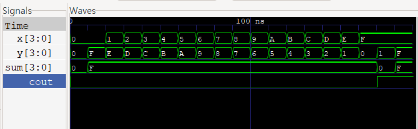

# Project 4: N bit Adder

## 1. Introduction & Design Architecture

### Introduction
The previously designed adder was strictly fixed to 4-bit operations, presenting significant scalability limitations for direct application in real-world systems that must handle varying data sizes. Modern processors (such as CPUs and NPUs) and data processing units require arithmetic operations across diverse specifications, including 8-bit, 32-bit, and 64-bit widths. Hardcoding a new adder from scratch for every required bit-width is highly inefficient and misaligned with industry best practices.

### Design Direction
The core objective of this project is to maximize the **Flexibility** and **Reusability** of the hardware module. To achieve this, Verilog HDL's `parameter` declarations and `generate` loops are actively utilized. This approach enables the design of a **Parameterized N-bit Adder**, where the hardware automatically scales and instantiates by simply specifying the bit-width ($N$) externally, eliminating the need to modify the internal structure.

More than just implementing a simple adder, this project establishes a robust foundation for designing a versatile Arithmetic Logic Unit (ALU) capable of dynamically processing data of various sizes in the future.

## 2. RTL Design

### 1) Design Module 1: Full Adder (`calculate_adder`)
```verilog
module calculate_adder(
    input x, y, cin,
    output sum, cout
);
    wire s1, c1, c2;

    half_adder HA1(
        .a(x),
        .b(y),
        .sum(s1),
        .carry(c1)
    );

    half_adder HA2(
        .a(s1),
        .b(cin),
        .sum(sum),
        .carry(c2)
    );

    assign cout = c1 | c2;
endmodule
```
* **Hierarchical Design & IP Reusability:** By instantiating the previously verified Half Adder modules (half_adder) as sub-blocks within a Hierarchical Structure, this design effectively avoids redundant coding and maximizes the efficient reuse of existing hardware resources.

### 2) Design Module 2: Parameterized N-bit Adder (`N_bit_adder`)

```verilog
module N_bit_adder #(parameter N=4)(
    input [N-1:0] a, b,
    input cin,
    output [N-1:0] sum,
    output cout
);
    wire [N:0] c;

    assign c[0] = cin;

    genvar i;

    generate
        for(i=0; i<N; i=i+1) begin: adder_gen
            calculate_adder FA(
                .x(a[i]), 
                .y(b[i]), 
                .cin(c[i]), 
                .sum(sum[i]),
                .cout(c[i+1])
            );
        end
    endgenerate

    assign cout = c[N];
endmodule
```

* **Scalability (Parameterization):** Configured the input vectors (a, b) and the output vector (sum) to be N bits wide. By declaring parameter N=4, the module is highly scalable and can dynamically adjust its data bus width without altering the core logic.

* **Ripple Carry Architecture:** Declared an internal carry chain array (wire [N:0] c;) to accurately propagate the carry-out from one bit stage to the carry-in of the next. This intuitively models the physical wire routing and the operational mechanism of a hardware Ripple Carry Adder (RCA).

* **Generate Block Instantiation:** Utilized a generate for loop (genvar i) to automatically instantiate the calculate_adder (Full Adder) modules N times. This elegantly handles the repeated logic generation corresponding to the parameterized bit-width, preventing redundant manual hardcoding.

* **Final Carry-Out:** The first index of the carry chain (c[0]) is initialized with the external cin. After the N-bit addition is complete, the Most Significant Bit (MSB) of the carry chain (c[N]) is securely assigned to the final cout port.

## 3. Testbench

```verilog
`timescale 1ns/1ps
module N_bit_adder_tb #(parameter N=4);
    reg [N-1:0] x, y;
    reg cin;
    wire [N-1:0] sum;
    wire cout;

    N_bit_adder #(.N(4)) uut(
        .a(x),
        .b(y),
        .cin(cin),
        .sum(sum),
        .cout(cout)
    );

    initial begin
        $monitor("Time=%0t | A=%d, B=%d, Cin=%b | Sum=%d, Cout=%b", $time, x, y, cin, sum, cout);
    end

    initial begin
        $dumpfile("N_bit.vcd");
        $dumpvars(0, N_bit_adder_tb);
    end

    integer i;
    initial begin
        x=4'd0; y=4'd0; cin=1'b0;
        #10;
        for(i=0; i<16; i=i+1) begin
            x=i;
            y=15-i;
            cin=0;
            #10;
        end

        x=4'd15; y=4'd1; cin=1'b0;
        #10;

        x=4'hF; y=4'hF; cin=1'b1;
        #10;

        $finish;
    end
endmodule
```

* Declared x and y as N-bit reg types to apply external input values. sum was also declared with the same N-bit width, while cin and cout were declared as 1-bit.

* Instantiated the design module with a parameter of N=4.

* Used the $monitor function to check the real-time values.

* Declared $dumpfile and $dumpvars to extract the .vcd waveform file.

* Since the parameter N is 4, the initial values were set to 4-bit 0000 for x and y, and 0 for cin.

* First, designed a loop so that the addition results in a constant sum value.

* After that, set up two specific cases where the sum of x and y exceeds the 4-bit capacity.

## 4. Waveform Verification



* When the `sum` is `F` (15), it is because the loop was specifically configured to keep the sum constant.
* At 170ns~180ns, during the $15 + 1$ operation, an **Overflow** occurs, exceeding the 4-bit representation range. It was verified that the adder operates correctly, as `cout` is activated to `1` and the `sum` **wraps around** to `0`.


## 5. Conclusion

* **Improved Design Productivity**: Breaking away from the hardcoded 4-bit design, I acquired the ability for **Generic Design**, creating adders of various bit widths with a single code using `parameter` and `generate` statements.
* **Structural Understanding**: By hierarchically connecting the lower-level Full Adder modules, I clearly understood the internal operation principles and the carry propagation process of the **Ripple Carry Adder (RCA)**.
* **Efficient Verification**: I improved verification efficiency by automating multiple operation cases using a loop in the testbench. In particular, I perfectly verified the hardware's behavior in limit situations by analyzing the waveform when a Carry-out (`cout`) occurred.

Based on this project experience, I plan to expand my design into speed-optimized arithmetic units like the **Carry Look-ahead Adder (CLA)**, moving beyond the simple RCA.