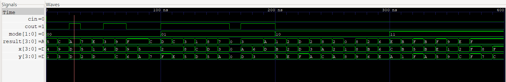

# Project 5: ALU
## 1. Introduction & Design Architecture

### Introduction
Building upon the structural understanding of the previously designed individual hardware modules (Adder and Subtractor), this project focuses on designing an **Arithmetic Logic Unit (ALU)**, the core execution engine of a computer processor (CPU). Moving beyond traditional hardware limited to a single operation, this project establishes the fundamentals of practical Data Path design by integrating both arithmetic and bitwise logical operations within a single, unified hardware block.

### Design Direction
The core of this design lies in dynamically controlling the hardware's behavior based on an externally applied **Control Signal (Selection Signal / Opcode)**. By utilizing the `case` statement in Verilog to internally model a Multiplexer (MUX) structure, the architecture is configured to selectively execute the following four key operations based on the input signal:

* **Case 1 (Addition, ADD)**: Calculates the arithmetic sum of the two input data.
* **Case 2 (Subtraction, SUB)**: Calculates the arithmetic difference utilizing the 2's complement system.
* **Case 3 (Logical AND, AND)**: Performs a bitwise AND operation, commonly used for data masking.
* **Case 4 (Logical OR, OR)**: Performs a bitwise OR operation, used for activating specific bits.

## 2. RTL Design

### 1) Design Module 1: Parameterized N-bit Adder (`N_bit_adder`)
```verilog
module N_bit_adder#(parameter N=4)(
    input [N-1:0] a, b,
    input cin,
    output [N-1:0] sum,
    output cout
);
    wire [N:0] c;

    assign c[0] = cin;

    genvar i;

    generate
        for(i=0; i<N; i=i+1) begin: adder_gen
            calculate_adder FA(
                .x(a[i]), 
                .y(b[i]), 
                .cin(c[i]), 
                .sum(sum[i]),
                .cout(c[i+1])
            );
        end
    endgenerate

    assign cout = c[N];
endmodule
```


### 2) Design Module 2: Parameterized N-bit Subtractor (`calculate_sub`)

```verilog
module calculate_sub #(parameter N=4)(
    input [N-1:0] a, b,
    output [N-1:0] sum,
    input cin,
    output cout
);
    wire [N-1:0] val_a = (a >= b) ? a : b;
    wire [N-1:0] pre_b = (a >= b) ? b : a;
    wire [N-1:0] val_b = ~pre_b;
    wire [N:0] ci;
    
    assign ci[0] = 1'b1;
    
    genvar i;
    generate
        for(i=0; i<N; i=i+1) begin: gen_cal
            adder FA(
                .a(val_a[i]),
                .b(val_b[i]),
                .cin(ci[i]),
                .sum(sum[i]),
                .cout(ci[i+1])
            );
        end
    endgenerate

    assign cout = ci[N];
endmodule
```
* **IP Reusability & Design Efficiency:** Maximized overall design efficiency by instantiating the previously verified modules from the prior project. By reusing established and tested hardware IP, this approach significantly reduces redundant coding efforts and ensures highly reliable operation for the absolute difference logic.

### 3) Design Module 3: ALU (`alu_Nbit`)

```verilog
module alu_Nbit #(parameter N=4)(
    input [N-1:0] a, b,
    input [1:0] mode,
    input cin,
    output reg [N:0] result,
    output reg cout
);
    wire[N-1:0] add_sum;
    wire[N-1:0] sub_sum;
    wire sub_cout;
    wire add_cout;

    N_bit_adder #(.N(N)) uut0(
        .a(a),
        .b(b),
        .cout(add_cout),
        .sum(add_sum),
        .cin(cin)
    );

    calculate_sub #(.N(N)) uut1(
        .a(a),
        .b(b),
        .cout(sub_cout),
        .cin(cin),
        .sum(sub_sum)
    );

    always @(*) begin
        case(mode)
            2'b00:begin
                result = {add_cout, add_sum};
                cout=add_cout;
            end
            2'b01:begin
                result = {1'b0, sub_sum};
                cout=sub_cout;
            end
            2'b10: result = {1'b0, a & b};
            2'b11: result = {1'b0, a | b};
            default: result = 0;
        endcase
    end
endmodule
```

* Declared `a` and `b` to receive N-bit input values.

* Set result to be 1 bit larger to flexibly handle potential overflow.

* Designed to control four operations (Addition, Subtraction, AND, OR) using a 2-bit mode signal.

* Instantiated the N-bit adder module and the subtractor module.

* Used a case statement to set addition when mode is `00`, subtraction for `01`, AND operation for `10`, and OR operation for `11`.

* Used default to prevent any potential errors.

## 3. Testbench

```verilog
`timescale 1ns/1ps
module ALU_tb#(parameter N=4);
    reg [N-1:0] x, y;
    reg [1:0] mode;
    reg cin;
    wire [N:0] result;
    wire cout;

    initial begin
        $monitor("mode=%b | a=%b, b=%b, cin=%b | sum=%b, result=%b", mode, x, y, cin, result, cout);
    end

    initial begin
        $dumpfile("ALU.vcd");
        $dumpvars(0, ALU_tb);
    end

    alu_Nbit #(.N(4))uut(
        .a(x),
        .b(y),
        .cin(cin),
        .mode(mode),
        .cout(cout),
        .result(result)
    );

    integer i, j;
    initial begin
        for(i=0; i<4; i=i+1) begin
            mode = i;
            for(j=0; j<10; j=j+1) begin
                x = $random;
                y = $random;
                cin = 1'b0;
                #10;
            end
        end
    end
endmodule
```
* Declared external input values `x`, `y`, `mode`, and `cin` as reg types, and the outputs result and `cout` as wire types.

* Used an integer to loop 4 times, since mode `00` is addition, `01` is subtraction, `10` is AND, and `11` is OR.

* Repeated 10 times for each mode, resulting in a total of 40 iterations. cin was set to 0.

## 4. Waveform Verification



We confirmed that the waveform outputs were correct for all test cases, as cin was set to 0 for all operations.

1) **Mode 00 (Addition):** When `x=D` and `y=D`, the result is `A`.

* Since `D=13`, in 4-bit binary it is `1101`. The calculation is `1101 + 1101 = 11010`. We observe a cout (carry-out) of `1`, and the 4-bit result becomes `1010 (A)`, confirming a successful addition.


2) **Mode 00 (Addition):** When `x=9` and `y=6`, the result is `F`.

* In binary, `1001 + 0110 = 1111 (15)`. With `cout=0` and `result=F`, the output is verified as correct.


3) **Mode 01 (Subtraction):** When `x=D` and `y=5`, the result is `8`.

* This operation represents `1101 - 0101`. Using the 2's complement of `0101 (1011)`, the calculation becomes `1101 + 1011 = 11000`. This confirms `cout=1` and the result `1000 (8)` is correctly output.


4) **Mode 01 (Subtraction):** When `x=0` and `y=0`, the result is `0`.

* The operation is `0000 - 0000`. As the 2's complement of `0000` is `0000`, the sum `0000 + 0000 = 0000` confirms `cout=0` and `result=0`, matching the design intent.


5) **Mode 10 (AND Operation):** When `x=D` and `y=F`, the result is `D`.

* In binary, `1101 & 1111 = 1101`. Passing the inputs through the AND gate logic correctly outputs `D`.


6) **Mode 11 (OR Operation):** When `x=1` and `y=9`, the result is `9`.

* In binary, `0001 | 1001 = 1001`. Passing the inputs through the OR gate logic correctly outputs 9.

## 5. Conclusion
* Understanding Hierarchical Design: Implemented a Top-Down design methodology by encapsulating independent Adder and Subtractor modules as sub-components managed by a top-level controller, establishing a fundamental understanding of complex system construction.

* Data Integrity & Overflow Handling: Designed the output signal width to N+1 bits to prevent data loss by accurately capturing the Carry-out, ensuring reliable detection and verification of arithmetic overflows.

* Verification Automation: Leveraged for loops and the $random function in the testbench to automate a wide array of input test cases (40 iterations total). This approach surpassed the limitations of manual verification and significantly enhanced the overall reliability of the hardware design.