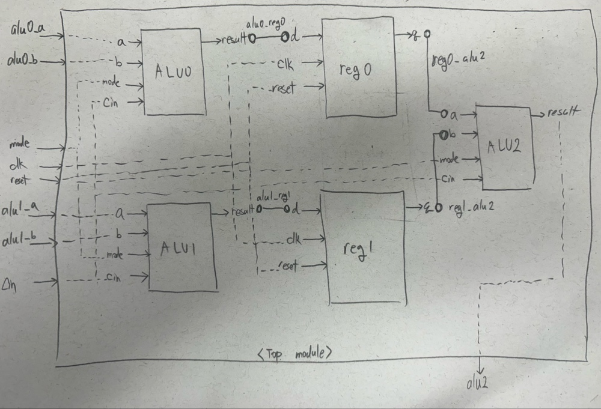
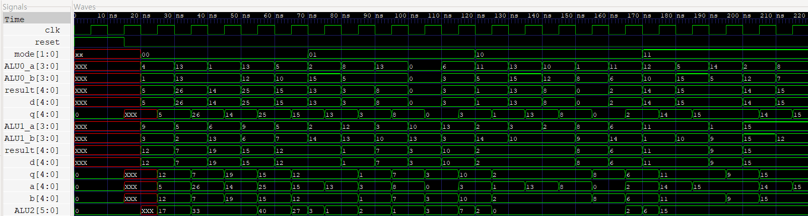

# Project 6: Topmodule using Register

## 1. Introduction & Design Architecture

### Register Architecture
A Register is the fundamental storage element used for temporarily holding data within a CPU or a digital system. It is designed to act as a high-speed buffer to maintain data integrity during computational cycles.

* Fundamental Mechanism: A register is composed of Flip-Flops, which are the minimal storage units that capture 1-bit of data synchronized to the clock edge. By connecting multiple Flip-Flops in parallel, registers can hold data of a specific bit-width.

* The Role of an Orchestrator: Beyond mere storage, registers function as orchestrators within a digital system. They synchronize data flow between modules operating at different speeds, ensuring timing stability and preventing Race Conditions by aligning data transitions with the clock cycles.

* Why We Use Them: Registers are critical for minimizing computational latency, ensuring data stability, and preventing logical errors in complex digital circuits.

Storage Hierarchy
- Registers: Instantaneous, cycle-by-cycle storage.
- RAM (Main Memory): Short-term, volatile storage.
- SSD/HDD: Long-term, non-volatile (permanent) storage.


### Top Module Architecture

The Top Module serves as the final assembly layer of the hardware design. It functions as the highest level of the design hierarchy, responsible for integrating various sub-modules into a cohesive system.

* System Blueprint: The Top Module instantiates and interconnects individual hardware components (such as ALUs, registers, and FSMs), defining the overall logic and behavior of the complete system.

* Interface Management: It serves as the primary gateway for the system, managing the Input/Output (I/O) ports that interface with the external environment, ensuring proper communication between the internal logic and the outside world.

## 2. RTL Design

### 1) N-bit Register (`register_Nbit`)

```verilog
module register_Nbit #(parameter N=4)(
    input clk,
    input reset,
    input [N:0] d,
    output reg [N:0] q
);

    always @(posedge clk or posedge reset) begin
        if(reset) begin
            q <= 0; // High-priority asynchronous initialization
        end else begin
            q <= d; // Synchronous data capture on clock edge
        end
    end
endmodule
```
* The structure of the register is simple.
I declared clk for speed control, reset for initialization, input `d`, and output `q`.
I used posedge clk to utilize the flip-flop circuit.
The always block operates when `clk` or `reset` is **1**. I placed if(reset) first to prioritize the reset condition.
When reset is triggered, I assigned **0** to `q` to initialize the value.
When the clock triggers, the input value `d` is assigned to `q`.

### 2) N-bit ALU ('alu_Nbit')
```verilog
module alu_Nbit #(parameter N=4)(
    input [N-1:0]a,b,
    input [1:0]mode,
    input cin,
    output reg [N:0] result
);
    wire[N-1:0] add_sum;
    wire[N-1:0] sub_sum;
    wire sub_cout;
    wire add_cout;

    N_bit_adder #(.N(N)) uut0(
        .a(a),
        .b(b),
        .cout(add_cout),
        .sum(add_sum),
        .cin(cin)
    );

    calculate_sub  #(.N(N)) uut1(
        .a(a),
        .b(b),
        .cout(sub_cout),
        .cin(cin),
        .sum(sub_sum)
    );

    always @(*) begin
        case(mode)
            2'b00:result={add_cout, add_sum};
            2'b01:result={1'b0, sub_sum};
            2'b10:result={1'b0, a&b};
            2'b11:result={1'b0,a|b};
            default:result=0;
        endcase
    end
endmodule
```
* Utilized the N-bit ALU verified in the previous project.

### 3) Top Module ('Top_module')
```verilog
module Top_module(
    input [3:0] alu0_a,alu0_b,
    input [3:0] alu1_a,alu1_b,
    input [1:0] mode,
    output [5:0] alu2,
    input clk,reset
);
    wire[4:0] alu0_reg0;
    wire[4:0] alu1_reg1;
    wire[4:0] reg0_alu2;
    wire[4:0] reg1_alu2;

    alu_Nbit #(.N(4)) ALU0(
        .a(alu0_a),
        .b(alu0_b),
        .result(alu0_reg0),
        .mode(mode),
        .cin(1'b0)
    );

    alu_Nbit #(.N(4)) ALU1(
        .a(alu1_a),
        .b(alu1_b),
        .result(alu1_reg1),
        .mode(mode),
        .cin(1'b0)
    );

    register_Nbit #(.N(4)) reg0(
        .d(alu0_reg0),
        .q(reg0_alu2),
        .clk(clk),
        .reset(reset)
    );

    register_Nbit #(.N(4)) reg1(
        .d(alu1_reg1),
        .q(reg1_alu2),
        .clk(clk),
        .reset(reset)
    );

    alu_Nbit #(.N(5)) ALU2(
        .a(reg0_alu2),
        .b(reg1_alu2),
        .result(alu2),
        .mode(mode),
        .cin(1'b0)
    );
endmodule
```
* It is set to N bits, making it easy to modify the bit width. The result was set 1 bit larger to account for potential overflow.

Below is the data path designed before the Top Module implementation.



* The areas marked with dotted lines indicate module instantiation, and the connections between nodes signify wires. Arrows pointing into the module represent inputs, while those pointing out represent outputs.

## 3. TestBench
```verilog
`timescale 1ns/1ps
module Top_module_tb;
    reg [3:0] ALU0_a, ALU0_b;
    reg [3:0] ALU1_a, ALU1_b;
    wire [5:0] ALU2;
    reg [1:0] mode;
    reg clk,reset;

    always #5 clk =~clk;

    initial begin
        $dumpfile("Top_module.vcd");
        $dumpvars(0,Top_module_tb);
        
        clk=0;
        reset=1;
        #15 reset=0;
    end

    initial begin
        $monitor("Time:%t | mode:%b || ALU0_a=%b, ALU0_b=%b | ALU1_a=%b, ALU1_b=%b || OUTPUT=%d (%b)",$time,mode,ALU0_a,ALU0_b,ALU1_a,ALU1_b,ALU2,ALU2);
    end

    Top_module uut(
        .alu0_a(ALU0_a),
        .alu0_b(ALU0_b),
        .alu1_a(ALU1_a),
        .alu1_b(ALU1_b),
        .alu2(ALU2),
        .clk(clk),
        .reset(reset),
        .mode(mode)
    );

    integer i,j;
    initial begin
        #20;
        for(i=0;i<4;i=i+1) begin
            mode=i;
            for(j=0;j<5;j=j+1) begin
                ALU0_a=$random%16;
                ALU0_b=$random%16;
                ALU1_a=$random%16;
                ALU1_b=$random%16;
                #10;
            end
        end
        $finish;
    end
endmodule
```
* The clock cycle is 10ns.
* The simulation started after 20ns to allow for value stabilization.
* The inputs for ALU0 and ALU1 were restricted to a range of 0–15, and random values were applied five times for each operation mode.

## 4. WaveForm Verification


The system is configured such that the register receives the operation result and outputs it upon the rising edge of the clock; therefore, the waveform for `q` appears 5ns later than `d`.

**1. Mode 00**
* During the **30ns–40ns** interval, ALU0 inputs are a=13, b=13, and ALU1 inputs are `a=5`, `b=2`.
Since `13+13=26` and `5+2=7`, we confirmed that each result is free of design flaws.

* In the **30ns–40ns** segment, after the operation result is input `(d)`, it is reflected in the register output `(q)` on the next Positive Clock Edge.

* This proves that this is not a **5ns** delay (latency), but rather the data being stably latched and synchronized to the clock as intended by the design.

**2. Mode 01**
* During the **80ns–90ns** interval, ALU0 inputs are `a=8`, `b=5`, and ALU1 inputs are `a=12`, `b=13`.
Since `8-5=3` and `13-12=1`, we confirmed that each result is free of design flaws.

* The register operated according to the next clock edge. We confirmed that the outputs were immediately fed into the input ports of ALU2, resulting in waveforms of `a=3` and `b=1`. The result waveform of 2 confirms that functional integrity is maintained.

**3. Mode 10**
* During the **140ns–150ns** interval, ALU0 inputs are `a=10`,`b=12`, and ALU1 inputs are `a=2`, `b=10`.
* Performing an AND operation on `10 (1010)` and `12 (1100)`, and on `2 (0010)` and `10 (1010)`, results in `1000` and `0010`, respectively. 
* The register operated according to the next clock edge. The inputs `1000` and `0010` fed into the input ports of ALU2 result in 0000 when performing an AND operation, confirming that the result of 0 maintains functional integrity.

**4. Mode 11**
* During the **190ns–200ns** interval, ALU0 inputs are `a=14`, `b=5`, and ALU1 inputs are `a=1`, `b=9`.
Performing an OR operation on `14 (1110)` and `5 (0101)`, and on `1 (0001)` and `9 (1001)`, results in `1111` and `1001`, respectively.

* The register operated according to the next clock edge.
The inputs `1111` and `1001` fed into the input ports of ALU2 result in `1111` when performing an OR operation, confirming that the result of 15 maintains functional integrity.


## 5. Conclusion
**1. Rediscovering Pipelining**

During the design process, the question, "Doesn't the register slow down the calculation speed?", became a significant turning point in understanding the relationship between Latency and Throughput.

* Structural Advantage: By placing registers between ALU operation paths, I shortened the Critical Path.
* Performance Maximization: Although a 1-clock latency occurs before the first data output, I laid the foundation to dramatically increase Throughput by shortening the clock cycle to under 10ns (aiming for ps units).
* Importance of Synchronization: By observing the process where all operation results are captured by registers at the clock edge, I learned how to ensure the timing stability of the entire system.

**2. Design Achievements and Integrity Verification**

* Functional Integrity: I demonstrated that the results of arithmetic (addition, subtraction) and logic (AND, OR) operations are Bit-accurate to the design specifications throughout the entire simulation.
* Hierarchical Design: By efficiently instantiating and wiring sub-modules within the Top Module, I cultivated the ability to structurally manage complex systems.