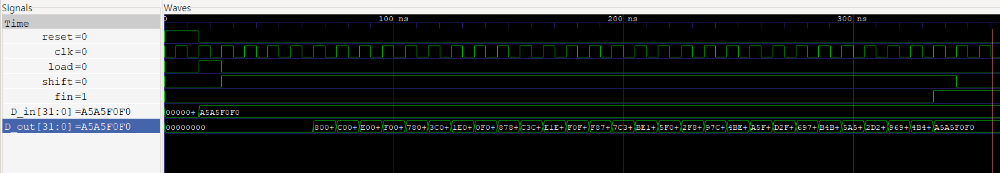

# Project 7: Latch, Flip-flop and Register

## 1. Introduction & Design Architecture

### 1. Introduction
The SR latch is one of the simplest memory elements used to implement sequential circuits.
The SR latch has two inputs, `S (set)` and `R (reset)`, and outputs `Q` and `not-Q (n_Q)`.

#### 1) Basic Memory Elements
**SR Latch**
```verilog
module SR_latch(
    input S,R,
    output Q,n_Q
);

assign Q= ~(R|n_Q);
assign n_Q= ~(S|Q);
endmodule
```
The negation of the logical OR of `R` and `n_Q is Q`.

The negation of the logical OR of `S` and `Q is n_Q`.

* When S=1, R=0, Q=1 (set)
* When S=0, R=1, Q=0 (reset)
* When S=0, R=0, Q retains its previous output.
* When S=1, R=1, Q becomes 0, but n_Q also becomes 0, so this state is not used.

Because the SR Latch has the characteristic of remembering states, it is usefully applied in debouncing circuits that maintain a clean signal by eliminating mechanical noise (bouncing phenomenon) generated from physical switches.

However, it has a critical weakness: when both inputs are `1`, `n_Q`, which should be the complement of `Q`, ends up having the same value as `Q`.

The D latch was introduced to fundamentally prevent this forbidden state of the SR latch and compensate for its drawbacks.

**D latch**
```verilog
module d_latch (
    input d,
    input en,
    input reset,
    output reg q
);
    always @(*) begin
        if (reset) begin
            q <= 1'b0;
        end

        else if (en) begin
            q <= d; 
        end
    end
endmodule
```
* The D latch utilizes the always block to maintain its value through a sequential circuit.
When **reset=1**, the value `0` is assigned to output `q`, and only when **reset=0** and `en=1`, the value of `d` is assigned to `q`.
* Since the reset signal has the highest priority, the output is initialized to `0` when **reset=1**. In the state where **reset=0**, the operation is determined by the Enable (en) signal; when `en=1`, the value of input `d` is directly passed to `q`, and the moment `en=0`, it finally remembers and holds the previous value.

#### Although the D Latch resolved the logical contradiction of the SR Latch, it has a structural limitation in that it operates in a 'Level-Triggered' manner. That is, it possesses Transparency, where changes in the input are directly reflected in the output as long as the Enable signal remains at 1. Because of this, in complex sequential circuits connected in multiple stages (e.g., shift registers), there is a high risk of a Race Condition occurring, where data unintentionally passes through multiple stages within a single clock cycle.

>The D Flip-Flop was designed to fundamentally solve these timing issues.

**D flip-flop**
```verilog
module D_flip_flop (
    input d,
    input clk,
    input reset,
    output reg q
);
    always @(posedge clk or posedge reset) begin
        if (reset) begin
            q <= 1'b0;
        end

        else begin
            q <= d; 
        end
    end
endmodule
```
* In Verilog, there is a concept called posedge (Positive Edge). A clock (clk) signal repeats `0` and `1` at regular intervals like a periodic function, and the brief moment when the value instantly shoots up from `0` to `1` is what we call the 'Rising Edge'.
* The always @(posedge clk or posedge reset) statement instructs it to operate only when the rising edge of the clock occurs or when a reset signal comes in. In other words, because the D Flip-Flop captures the value of input `d` and transfers it to `q` exactly at the precise moment the clock signal rises, it perfectly solves the transparency issue and can stably synchronize the data.

> By synthesizing these concepts, we can arrive at the Tx (Transmitter), Rx (Receiver), and shift register.
#### 2) Shift Register & Serial Communication

* The edge-triggered D Flip-Flop designed earlier is an element that can most safely store and transfer a single bit of data. If multiple of these D Flip-Flops are connected in a row (like a train) and the same clock (clk) signal is applied, a circuit is created where data moves in an orderly fashion to the next slot one by one whenever a rising clock edge occurs. This is called a Shift Register.

* Beyond simply moving data, the shift register plays a core role in data communication between digital systems. Inside a computer (CPU, NPU, etc.), data is processed rapidly at once in a Parallel manner using multiple wires, such as 8-bit or 64-bit. However, when communicating with external devices, connecting dozens of physical wires is highly inefficient in terms of space and cost, so a method of sending data sequentially, 1 bit at a time, through a single wire (Serial) is used.

* Here, the device that converts the data format from parallel to serial, and from serial to parallel, is precisely the shift register, and through this, the Tx (Transmitter) and Rx (Receiver) are implemented.

**(1) Tx (Transmitter) : Parallel $\rightarrow$ Serial Conversion (PISO)**

The core of the transmitter is to load multi-bit parallel internal data into the shift register all at once, and then push it out one bit at a time sequentially through a single wire (TX line) in synchronization with the clock signal. This is called a PISO (Parallel-In Serial-Out) structure.

**(2) Rx (Receiver) : Serial $\rightarrow$ Parallel Conversion (SIPO)**

The receiver performs the opposite role of the transmitter. It collects the data coming in one bit at a time through a single wire (RX line) by systematically pushing it into the shift register starting from the first slot, in synchronization with the clock. Once the agreed-upon number of bits (e.g., 8-bit, 64-bit, etc.) are all received, it groups them together and restores them into parallel data that can be transferred inside the computer. This is called a SIPO (Serial-In Parallel-Out) structure.

In conclusion, the D Flip-Flop-based shift register can move data accurately without timing conflicts (Race Conditions), making it the most powerful and essential backbone for converting data between serial and parallel formats and enabling communication in Tx and Rx circuits.

### 2. Design Architecture

In this project, we design a 32-bit serial communication system based on the principles of the shift register and D Flip-Flop explained earlier. After loading 32-bit parallel data into the Tx module, it is transmitted to the Rx module through a single serial wire (Serial Line) synchronized to the clock (clk) signal. The Rx module systematically collects the received 1-bit serial data and restores it back into 32-bit parallel data. Furthermore, to increase code reusability, it is designed with versatility by applying parameter W=32 so that the data bit width can be flexibly adjusted. Ultimately, the goal is to verify through testbench simulation waveforms that the transmitted data and the received data match exactly.

## RTL Design

### 1) Tx ('TX_shift_reg')
```verilog
module TX_shift_reg #(parameter W=32)(
    input [W-1:0]D_in,
    input clk,reset,load,shift,
    output N,fin
);

    reg [5:0]count;
    reg [W-1:0]Q_a;
    assign N=Q_a[0];
    assign fin=(count==32)?1'b1:1'b0;

    always @(posedge clk or posedge reset) begin
        if(reset)begin
            Q_a<=0;
        end

        else if(load)begin
            Q_a<=D_in;
        end

        else if(shift)begin
            Q_a<={1'b0,Q_a[W-1:1]};
        end
    end

    always @(posedge clk or posedge reset) begin
        if(reset)begin
            count<=0;
        end

        else if(load)begin
            count<=0;
        end

        else if(shift)begin
            count<=count+1;
        end
    end
endmodule
```
This is a PISO (Parallel-In Serial-Out) logic that receives data in parallel and outputs it in serial.

* Operating Principle: When the load signal is activated, the input D_in is loaded in parallel into the internal register Q_a. Afterward, when the shift signal is activated, the values of Q_a move to the right by one position (Shift-right) at every rising edge.

* Bit Concatenation: Although the shift operator (>>) could be used, a bit slicing and concatenation method such as {1'b0, Q_a[W-1:1]} was used to intuitively express the hardware data movement structure. The Least Significant Bit (LSB) that drops out as it shifts is transmitted to the Rx through N, a 1-bit wire.

* Completion Signal: When the internal counter reaches 32 (binary 100000), it outputs a fin=1 signal indicating that the transmission is complete.

### 2) RX ('RX_shift_reg')
```verilog
module RX_shift_reg #(parameter W=32)(
    input N,
    input clk,reset,shift,
    output reg [W-1:0]D_out
);

    always @(posedge clk or posedge reset)begin
        if(reset)begin
            D_out<=0;
        end

        else if(shift)begin
            D_out<={N,D_out[W-1:1]};
        end
    end
endmodule
```

This is an SIPO (Serial-In Parallel-Out) logic that receives data coming in serially 1 bit at a time and assembles it back into 32-bit parallel data.

* Operating Principle: Like the Tx, it operates synchronized to the shift signal. Whenever a rising edge occurs, the 1-bit data N transmitted from the Tx enters the Most Significant Bit (MSB) of the receiver, and the existing data is pushed to the right by one position. Through this, the entire data is assembled sequentially.

### 3)Top_Module ('Top_register)
```verilog
module Top_register #(parameter W=32)(
    input clk,reset,shift,load,
    input [W-1:0] D_in,

    output [W-1:0] D_out,
    output fin
);
    wire N;

    TX_shift_reg #(.W(W))reg0(
        .clk(clk),.reset(reset),.shift(shift),.load(load),
        .D_in(D_in),.N(N),.fin(fin)
    );

    RX_shift_reg #(.W(W))reg1(
        .clk(clk),.reset(reset),.shift(shift),
        .D_out(D_out),.N(N)
    );
endmodule
```

This is the top module that connects the entire communication system by hierarchically instantiating the Tx and Rx modules.
By connecting the output N of the transmitter to the input N of the receiver with a wire, a 1-bit physical communication channel was modeled.

## 3.TestBench

```verilog
`timescale 1ns/1ps
module shift_reg_tb #(parameter W=32);
    reg [W-1:0]D_in;
    reg clk,load,reset,shift;
    wire [W-1:0]D_out;
    wire fin;

    always #5 clk=~clk;

    Top_register #(.W(32))uut0(
        .D_in(D_in),
        .clk(clk),
        .reset(reset),
        .load(load),
        .shift(shift),
        .D_out(D_out),
        .fin(fin)
    );

    initial begin
        $dumpfile("Shift_register.vcd");
        $dumpvars(0,shift_reg_tb);
    end

    integer i;

    initial begin
        clk=0; reset=1; load=0; shift=0;
        D_in = 32'd0;

        #15;
        reset=0;
        D_in=32'hA5A5_F0F0;

        @(posedge clk);
        load=1;

        @(posedge clk);
        load=0;
        shift=1;

        wait(fin==1'b1);

        @(posedge clk);
        shift=0;
        
        #20;
        $finish;
    end
endmodule
```
* Clock and Initialization: The clock (clk) cycle, which serves as the standard for system synchronization, was set to `10ns`. In the early part of the simulation `(0~15ns)`, a reset was applied to safely initialize the internal registers to 0`.

* Test Vector Application: To visually and clearly confirm whether the transmitted and received data match, a 32-bit hexadecimal value A5A5F0F0 (binary 1010_0101_1010_0101_1111_0000_1111_0000), which has an intuitive bit pattern, was applied as the test data (D_in).

* Communication Control Flow: After loading the data into the Tx module via `load=1`, the serial transmission was started at the next clock by changing to load=0 and `shift=1`. The system waited until `fin==1` to ensure all 32 bits were completely transmitted before stably terminating the simulation.

## 4.WaveForm Verification



As a result of the testbench execution, we verified through the waveform that the intended PISO-SIPO serial communication logic operates accurately without error.

1. **Data Loading (Load Phase):** The moment the load signal becomes High (1), the A5A5F0F0 data assigned to the Tx input, D_in, was successfully loaded into the internal register.

2. **Serial Transmission Start (Shift Phase):** As the load drops to Low (0) and the shift signal is activated, data transmission begins at every rising edge of the clock.

3. **Data Assembly Process Confirmation:** Looking at the D_out waveform, which is the output of the receiver, you can see that the value, initially 00000000, changes to 800..., C00..., E00..., etc., every time the clock ticks. This is clear evidence of the SIPO operation, where the data passed from the Tx is filled sequentially from the MSB of the Rx and shifted to the right.

4. **Transmission Completion and Integrity Confirmation (Finish Phase):** After exactly 32 clock cycles have passed, the transmission completion signal, fin, was activated to High (1). At this time, if we check the final parallel output value (D_out) of the receiver, we can confirm that it perfectly matches the data, A5A5F0F0, initially applied at the transmitter.
Through this, we confirmed that the 32-bit serial transmission and reception system based on clock synchronization was successfully designed without timing issues or data loss.


## 5. Conclusion
1. Rediscovering Sequential Circuits and Synchronization
During the design process, the question, "Why do we even need to use flip-flops?" became a significant turning point in understanding the relationship between hardware timing control and data stability.
    * Maximizing Timing Control: I learned the principles of stable data retention by overcoming the critical limitations of the Latch structure—Transparency and Race Condition—using the Edge-Triggered method of the D Flip-Flop.

    * Data Path Conversion: By directly designing the PISO/SIPO structure that transmits dozens of lines of parallel data through a single wire, I grasped the core principles of Serial Communication, which resolves spatial and cost constraints.

    * Importance of Synchronization: Through the process where the Transmitter (Tx) and Receiver (Rx) exchange data under the same clock system without a single bit of lag, I learned how to ensure the Synchronization stability of the entire system.


2. Design Achievements and Integrity Verification
    * Functional Integrity: By applying an alternating bit pattern like A5A5F0F0, I demonstrated through waveforms that the 32-bit data is Bit-accurate to the specifications without the loss of a single bit across the entire transmission and reception phase.

    * Generic Design: By applying parameter W=32 to break away from simple hardcoding, I maximized code reusability and Flexibility so that it can be immediately applied to 64-bit or 128-bit systems in the future.

    * Hierarchical Design: By efficiently instantiating the Tx and Rx modules within the Top Module and wiring them with a 1-bit wire, I structurally and perfectly modeled the Inter-chip Communication connection on an actual board.